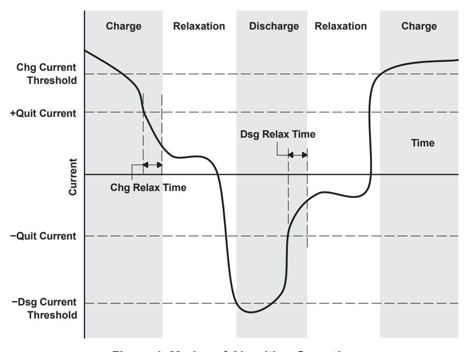
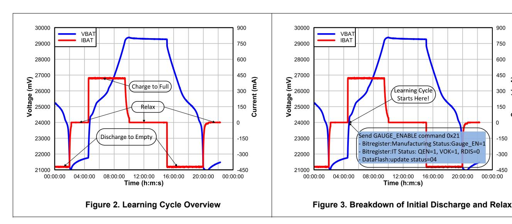
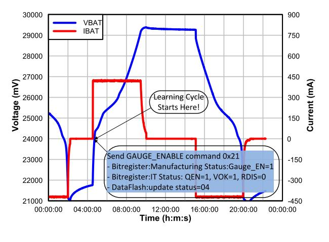
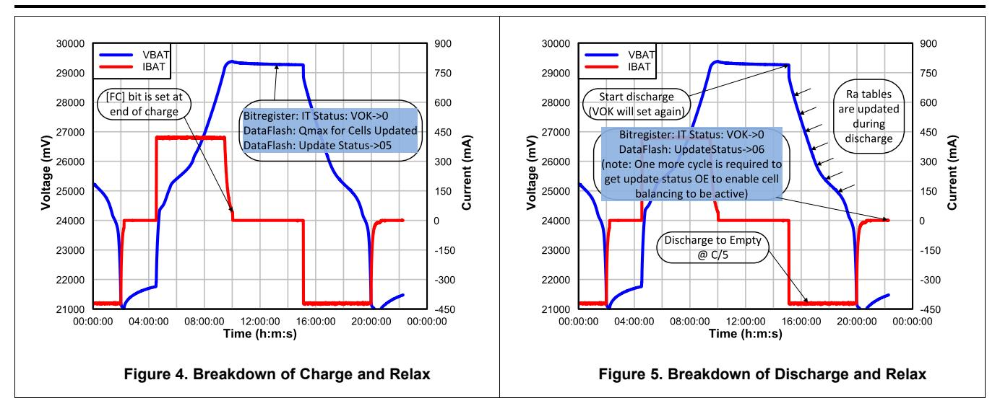

# Achieving The Successful Learning Cycle

Onyx Ahiakwo, Rushi Dalal, Steve Schnier

#### **ABSTRACT**

This paper discusses the steps necessary to complete the initial optimization cycle (also known as learning cycle) in order to ensure the accuracy and excellent performance of the gauge. A learning cycle is typically performed on a single representative battery pack during the development stage. The resulting values are then programmed into every pack during mass production as there should be minimal pack-to-pack variation for a well-controlled manufacturing process. The flash image extracted from a so-called "golden pack" during development is called the "golden file" and is used in mass production.

#### Contents 1 Introduction .................................... 2 Data Flash Configuration Settings Pertinent to Learning Cycle Completion .................................... 3 Learning Cycle .................................... 4 Learning Cycle Summary in Graphical Form .................................... 5 Conclusion .................................... **List of Figures** 1 Modes of Algorithm Operation .................................... Learning Cycle Overview .................................... 3 Breakdown of Initial Discharge and Relax.................................... 4 Breakdown of Charge and Relax .................................... 5 Breakdown of Discharge and Relax....................................

#### **List of Tables**

#### 1 Introduction

Impedance Track™ is a proprietary algorithm developed by Texas Instruments where the battery gauge dynamically learns the resistance and the total chemical capacity of the battery during field operation in order to maintain accurate predictions even as the battery cells age. In order to go into production, a golden file has to be created which is programmed on multiple devices. The learning cycle is a part of the golden file creation process which requires the user to carry out a few cycles on the pack to make sure that possible variation in cell manufacturer processes is accounted for in the learned resistance as well as to account for the board contact and trace resistances which could impact the gauges state of charge reporting and accuracy.

Battery chemistry needs to be determined before running the learning cycle. Texas Instruments has a database of thousands of battery profiles. Each profile has a unique number referred to as the chemistry identifier, or "ChemID". Programming a specific ChemID into an Impedance Track fuel gauge will update various public and private dataflash locations with the battery profile. This profile will then be used by the IT algorithm for capacity and resistance learning as well as for capacity predictions and other features. It is important that the proper ChemID be selected and programmed into the fuel gauge both for performing the learning cycle process and for production purposes. The ChemID selected should either be specifically generated for the cell or battery being used or it should be a very close match as determined by using the

*Introduction* [www.ti.com](http://www.ti.com)

[GPCCHEM](http://www.ti.com/tool/GPCCHEM) tool found on ti.com. The ChemID identification requires running a relax-discharge-relax (reldis-rel) test while logging data using the gauge's GUI ([bqStudio](http://www.ti.com/tool/BQSTUDIO?keyMatch=bqstudio)) and then using gpc chem tool with the logged data to identify a close match. If there is no match, then the cells have to be sent to TI for characterization and ChemID generation. Contact a local field applications engineer if cells have to be sent to TI. Once a ChemID has been identified or created, it has to be programmed on the fuel gauge.

**NOTE:** If an incorrect ChemID is used, the learning cycle may never successfully complete and the state of charge prediction may never be accurate.

Once the learning cycle is complete, the IT parameters, gauge parameters, and other settings can be exported in a Golden Image for use in manufacturing the battery pack. The full .srec file can be exported and programmed. Details on generating the Golden Image are included in [Section](#page-6-2) 3.2.7.

# **2 Data Flash Configuration Settings Pertinent to Learning Cycle Completion**

In order to have learning cycle successfully complete, certain parameters need to be configured specific to the application and the battery type in the gauge data flash. These parameters are Design Capacity, Design Voltage, Charge Term Taper Current, Discharge (Dsg) Current Threshold, Charge (Chg) Current Threshold, Quit Current and Term Voltage. The gauging algorithm state machine has three modes: charge, discharge, and relax.

**Figure 1. Modes of Algorithm Operation**

# *2.1 Design Capacity*

There are three parameters which should be set to match the target battery pack's nominal capacity. Design Capacity mAh and Design Capacity cWh should be set to the nominal capacity of the total pack with their respective units. Often this can be copied from the battery pack label or datasheet. Design Capacity mAh is also used for state of health (SOH) calculations, and should first be set to the value stated in the cell datasheet. After the learning cycle (discussed in [Section](#page-4-0) 3) completes, this value can be adjusted to the actual amount of capacity extracted under the application's real conditions. For example, if a cell datasheet specifies a nominal capacity based on charging to 4.2 V and discharging with 500 mA, but the target application actually only charges to 4.1 V and discharges with a 1000 mA load. In this case, the Design Capacity should be adjusted to a value determined through testing using the application charge and discharge conditions. Design Voltage should be set to the nominal or average voltage of your battery pack.For a multi-cell application, note that Design Voltage = (number of series cells) x average cell voltage. Most Li-ion cells have a nominal voltage of 3.6 V to 3.8 V and may be specified on the cell datasheet or label. All three of these data flash parameters can be found in the Gas Gauging subsection in the Data Memory plugin in bqStudio.

# *2.2 Charge Term Taper Current*

Most battery chargers have a ±10% error in taper current threshold at which point the charger cuts off charging. It is important to set the taper current programmed in the data flash of the gauge slightly higher than the taper current threshold of the charger. This ensures that the gauge detects the battery is fully charged before the charger cuts off charge. For example, if the charger taper current is 50 mA, it is recommended to set the charge termination taper current in data flash greater than 50 mA. A good value to use is 70 mA. Also, it is recommended that the taper current be between C/100 and C/10 to ensure that the battery gets properly fully charged. This setting is found in the Advanced Charge Algorithm, Termination Config section of Data Memory. Please note that this setting may be called "Taper Current" for some gauges.

# *2.3 Dsg Current Threshold*

This is the current threshold above which the gauge detects that it is in discharge mode. A positive number should be entered and the firmware automatically interpret it as a negative (discharge) current threshold. The default value is suitable for many applications, but if customized it should be set to a value lower than the minimum system draw when in active mode. When discharge current exceeds this threshold the algorithm enters the Discharge state. A value below C/10 is generally reasonable. This setting is found in the Gas Gauging, Current Thresholds section of Data Memory.

# *2.4 Chg Current Threshold*

This is the current above which the gauge detects that it is in charge mode. This value should be set lower than the Charge Term Taper Current as well. When positive current exceeds this value the algorithm enters the Charge state. This setting is found in the Gas Gauging, Current Thresholds section of Data Memory.

# *2.5 Quit Current*

This is the threshold that determines that the gauge enters relax mode. This mode is important because this is where the gauge takes OCV readings which are used for Qmax calculations. It is recommended that the quit current be less than C/20 and must be less than the Dsg Current Threshold and Chg Current Threshold. This setting is found in the Gas Guaging, Current Thresholds section of Data Memory.

# *2.6 Term Voltage*

Also called Terminate Voltage, this is essentially the empty pack voltage where the gauge should ensure 0% state of charge is reported. For learning cycle purposes, this should be set to the minimum voltage of the battery as specified in the manufacturer's data sheet. After the learning cycle is completed, this value can be adjusted upwards if there is a need for the gauge to report 0% at a higher voltage. If the cell is rated to operate from 3 V to 4.2 V and if the application is a single cell application, the term voltage should be set to 3000 mV. If the application has n cells in series, the term voltage should be set to 3 V x n cells. In some multicell gauges like the bq34z100, the data flash parameters is based off a single cell, even though it's configured for greater than 1s, and therefore the terminate voltage will be 3V in that case. This setting is in the Gas Gauging, IT Cfg section of Data Memory.

Note that in normal operation the gauge may report 0% at a voltage higher than Term Voltage because it learns the voltage spikes seen by your system and adds the average of those spikes to Term Voltage in order to predict empty at an earlier voltage so that a sudden spike does not cause a drop to 0%. These learned average spikes are kept in RAM but occasionally updated in the dataflash parameter Delta Voltage. Additionally, if Reserve Cap-mAh and Reserve Cap-cWh are not zero then the gauge further buffers the voltage at which 0% is reported in order to ensure that the reserve capacity is still available for shutdown before Term Voltage+Delta Voltage is actually reached.

[www.ti.com](http://www.ti.com) *Learning Cycle*

# **3 Learning Cycle**

The learning cycle is needed for the gauge to update the total chemical capacity (Qmax) and the resistance (Ra) tables in data flash. It is also needed for the Update Status which the gauge controls to indicate that a learning cycle has been completed. When running a learning cycle it is recommended to log all of the RAM values in the Registers plugin in bqStudio. This enables the data to be analyzed later for troubleshooting purposes. Furthermore, it can also assist debug if the Data Memory plugin is set to AutoExport .gg.csv files periodically. The rate of autoexporting .gg.csv files can be customized in the Window -> Preferences -> Data Memory settings. A period of 10-30 minutes is generally frequent enough without resulting in creation of too many files. When troubleshooting a failed learning cycle attempt, the register values can be analyzed and the progress of the data flash updates can be checked using the time stamps of the data points and the file creation dates.

**NOTE:** Depending on which gauge is selected in bqStudio, some of the bit registers may be have different names than those mentioned in the subsections below. For example, RDIS appears as "RUP\_DIS" and GAUGE\_EN appears as "IT\_ENABLE" in certain gauges such as bq27542.

# *3.1 Initial Qmax Update Criteria*

QMax update is enabled when gauging is enabled, which is done by sending the MAC subcommand GAUGE\_EN. This can be done manually, by using the Advanced Comm SMB plugin in bqStudio, or by clicking the GAUGE\_EN button in the Commands plugin on the right side of the bqStudio screen. Updates to the no-load full capacity (QMax) occur when two open circuit voltage (OCV) readings are taken. These OCV readings are taken when the battery is in a RELAXED state before and after a charge or discharge activity. A RELAXED state is achieved if the battery voltage has a dV/dt of <4 μV/s. Typically it takes 2 hours in a CHARGED state and 5 hours in a DISCHARGED state to ensure that the dV/dt condition is satisfied. If 5 hours are exceeded, a reading is taken even if the dV/dt condition was not satisfied. If a valid DOD0 (taken at a previous QMax update) is available, then QMax is also updated when a valid charge termination is detected. Qmax is not updated if the following occurs:

- **Temperature** If Temperature is outside of the range 10°C to 40°C.
- **Delta Capacity** If the capacity change between suitable battery rest periods is less than 90% of the full scale range of the OCV table during the initial QMax Update and 37% during field updates (2nd and subsequent updates) of QMax.
- **Voltage** If Voltage() is inside the flat voltage region. This flat region is different for each ChemID. The GaugingStatus[OCVFR] flag indicates if the cell voltage is inside this flat region.
- **Offset Error** If offset error accumulated during time passed from previous OCV reading exceeds 1% of Design Capacity, update is disqualified. Offset error current is calculated as Coulomb Counter Deadband/sense resistor value.

Several flags in ITStatus() are helpful to track for QMax update conditions. The [REST] flag indicates an OCV is taken in RELAX mode. The [VOK] flag indicates the last OCV reading is qualified for the QMax update. The [VOK] is set when charge or discharge starts. It is cleared when the QMax update occurs, when the offset error for a QMax disqualification is met, or when there is a full reset. The [QMax] flag is toggled when the QMax update occurs.

# *3.2 Learning Cycle Procedure*

#### **3.2.1 Discharge Battery to Empty**

- Send IT (Gauge) enable command (0x21), or use the GAUGE\_EN command to set the GAUGE\_EN in manufacturing status register and QEN flags in IT Status register. Then send the reset command (0x41), or select RESET, to set the RDIS flag and disable resistance updates during this initial discharge cycle. In this case, since IT has already been enabled, there is no need to disable it again during the entire learning cycle. Once IT has been enabled, verify the Update Status has changed to 04 in the Gas Gauging, State section of Data Memory.
- An alternative method before starting this initial discharge would be to make sure IT is disabled. The GAUGE\_EN flag of the manufacturing status register would be cleared if IT is disabled. If the

*Learning Cycle* [www.ti.com](http://www.ti.com)

GAUGE\_EN flag is set, clear it by sending command 0x21 or clicking the GAUGE\_EN button in the command window. This is different from earlier gauges in that IT enable command can be toggled on and off. In earlier gauges, once IT is enabled, it can never be disabled via command. Disabling impedance track prevents resistance updates from occurring during this initial discharge.

• Discharge the battery until the voltage reaches the Term Voltage.

### **3.2.2 Relax for at least 5 Hours**

- This relaxation time allows for a valid OCV reading to be taken and stored for the Qmax update. The valid OCV reading occurs when the dV/dt of the battery is < 4 µV/s. The voltages does not need to be monitored, the gauge monitors for this condition and takes the OCV reading once met.
- The [VOK] and [RDIS] bits in the IT status() register clear once the gauge has taken an OCV reading and qualified it for a Qmax update.
- The 5 hour wait time is a recommendation; the most accurate time is determine when the [VOK] and [RDIS] bits are clear, which can occur sooner than 5 hours. If the alternative method of disabling IT was used, IT enable command should be sent after the 5 hour wait time. This forces an OCV measurement to be taken, and because the cells are sufficiently rested, this OCV value is qualified for a Qmax update.
- The GaugingStatus[REST] flag is set when a valid OCV reading occurs.

# **3.2.3 Charge Battery to Full**

- A typical C/2 charge rate is recommended; however, the charge rate is of no consequence.
- Make sure IT is already enabled at this point before the start of charge (the [Gauge\_EN] bit in the manufacturing status() register should be set).
- At the start of charge, the [VOK] bit in the IT status () register sets automatically.
- At the end of charge the [FC] bit in the Battery Status () register should be set automatically. If it did not set then a full charge was not properly detected and the learning cycle fails. Correct either the charging conditions or the relevant dataflash settings to ensure the [FC] bit gets set and try again from the beginning.

# **3.2.4 Relax for at least 2 Hours**

- This relaxation time allows for a valid OCV reading to be taken and stored for the Qmax update. The valid OCV reading occurs when the dV/dt of the battery pack is < 4 µV/s. Again, the gauge monitors for this condition.
- The [VOK] bit in the IT status() register clears once the gauge has taken an OCV reading and qualified it for a Qmax update.
- The GaugingStatus[REST] flag is set when a valid OCV reading occurs
- The 2 hour wait time is a recommendation; the most accurate time is checking to determine when the [VOK] and [RDIS] bits are clear, which can occur sooner than 2 hours.
- At this point, the first Qmax update should have occurred. The [QMax] flag is toggled when the QMax update occurs. Update Status would now be 0x05. New values for Qmax should also be observable in the Gas Gauging section of the Data Memory view or in the autoexported .gg.csv files.
- Note that it takes less time for a battery to relax once it is fully charged than it does when it is discharged.

### **3.2.5 Discharge Battery to Empty**

- A typical C/5 rate is recommend, but the rate can be as low as C/10. If using a C/10 load, make sure the gauge sees that the current is at least C/10, if the current is any lower, resistance updates can not occur.
- During the discharge, the resistance tables are updated as each grid point is reached (the resistance tables for each cell are stored in 15 grid points along the discharge curve). The updates can be observed in the Ra Table section in Data Memory in bqStudio, or in the autoexported .gg.csv files.
- Update Status shouldn't change until the second Qmax update occurs during relaxation (assuming Ra was also updated during the discharge).

# **3.2.6 Relax for at least 5 Hours**

- This relaxation time allows for a valid OCV reading to be taken and stored for the Qmax update. The valid OCV reading occurs when the dV/dt of the battery is < 4 µV/s
- The [VOK] bit in the Control() register clears once the gauge has taken an OCV reading and qualified it for a Qmax update.
- The GaugingStatus[REST] flag is set when a valid OCV reading occurs.
- The 5 hour wait time is a recommendation. The most accurate time is determined by observing when the [VOK] bit clears, which can occur sooner than 5 hours.
- There is another Qmax update at this point, and this should be reflected in dataflash
- At this point Update Status should be at 0x06. When the packs are deployed in the end equipment and a field update occurs, the Update Status updates to 0x0E, which means that cell balancing has been enabled. If an Update Status of 0E is not obtained, the device can be charged to full, relaxed for 2 hours and then discharged to empty, at which point it should be 0E.

# **3.2.7 Generate the Golden Image**

The golden file can be extracted by clicking the golden image tab in bqStudio and then clicking the create image files button if one of the srec, bqfs, or dffs field box is checked. The srec and bqfs both contain the instruction flash (IF) and dataflash (DF), while the DFFS contains just the data flash content which is why it is smaller in size.

# **4 Learning Cycle Summary in Graphical Form**

*Conclusion* [www.ti.com](http://www.ti.com)

**NOTE:** The learning cycle summary described in this document is for a **pack-side gauge**. For a system-side gauge, the update statuses are different due to differences in firmware. Update status starts at 00, prior to initially discharging the cell to empty and relaxing. After charging and relaxing and Qmax updating, update status will be 01. After the discharge and relaxing and resistance updates have occurred, update status will be 02. If the learning cycle failed, don't fake it by manually changing update status to 02 as this will cause problems and gauging will not be accurate.

# **5 Conclusion**

The learning cycle is a critical and integral part of ensuring the proper functionality of a battery pack using the Impedance Track algorithm. Impedance Track and this step by step procedure for learning ensures the golden flash image extracted for mass production is fully optimized. The summary of the discussed steps are as follows:

- Program the ChemID that matches the cell to be used in the application
- Configure the data flash parameters for the application. The pertinent data flash parameters that are required for successful learning cycle are Design Capacity, Design Voltage, Charge Term Taper Current, Dsg Current Threshold, Chg Current Threshold, Quit Current, and Term Voltage. The following conditions must be met:
  - Charge Term Taper Current > Chg Current Threshold > Quit Current
  - At least, 90% passed charge of DOD is needed to occur during the initial charge.
- To complete a full learning cycle, the battery must complete a full charge-relax-discharge-relax cycle. The battery should be charged to the max voltage specified by the cell manufacturer and discharged to the min voltage specified as well to ensure the 90% passed charge condition is met. After a successful learning cycle, the Term Voltage and the voltage the cell is charged to can be adjusted to suit the application specifications.
  - Discharge the cell to empty and let them relax for at least 5 hours.
  - Enable Impedance Track (0x21), issue a reset command (0x41). Update Status changes from 00 to 04
  - Charge the cell to full ensuring that the [FC] bit gets set and let it relax for at least two hours. Qmax updates at this point and Update Status goes to 05.
  - Discharge the cell to empty using the typical discharge rate of your application. It must be between C/5 to C/10 rate, otherwise, the learning cycle fails. Resistance tables are updated during this discharge cycle.
  - Let the cell relax for 5 hours during which the Update Status would change to 06.
  - For multi-cell applications, another charge-relax-discharge- relax cycle may be run to ensure

[www.ti.com](http://www.ti.com) *Conclusion*

Update Status changes to 0E to activate cell balancing.

• Before saving the Golden File, set Update Status to 02 to disable IT gauging, set the Qmax Cycle Count to 0, and set the Cycle Count to 0. For a pack side gauge, this ensures that when the pack is assembled and gauging and lifetime data is enabled, the cycle counts start from 0.

#### **IMPORTANT NOTICE FOR TI DESIGN INFORMATION AND RESOURCES**

Texas Instruments Incorporated ('TI") technical, application or other design advice, services or information, including, but not limited to, reference designs and materials relating to evaluation modules, (collectively, "TI Resources") are intended to assist designers who are developing applications that incorporate TI products; by downloading, accessing or using any particular TI Resource in any way, you (individually or, if you are acting on behalf of a company, your company) agree to use it solely for this purpose and subject to the terms of this Notice.

TI's provision of TI Resources does not expand or otherwise alter TI's applicable published warranties or warranty disclaimers for TI products, and no additional obligations or liabilities arise from TI providing such TI Resources. TI reserves the right to make corrections, enhancements, improvements and other changes to its TI Resources.

You understand and agree that you remain responsible for using your independent analysis, evaluation and judgment in designing your applications and that you have full and exclusive responsibility to assure the safety of your applications and compliance of your applications (and of all TI products used in or for your applications) with all applicable regulations, laws and other applicable requirements. You represent that, with respect to your applications, you have all the necessary expertise to create and implement safeguards that (1) anticipate dangerous consequences of failures, (2) monitor failures and their consequences, and (3) lessen the likelihood of failures that might cause harm and take appropriate actions. You agree that prior to using or distributing any applications that include TI products, you will thoroughly test such applications and the functionality of such TI products as used in such applications. TI has not conducted any testing other than that specifically described in the published documentation for a particular TI Resource.

You are authorized to use, copy and modify any individual TI Resource only in connection with the development of applications that include the TI product(s) identified in such TI Resource. NO OTHER LICENSE, EXPRESS OR IMPLIED, BY ESTOPPEL OR OTHERWISE TO ANY OTHER TI INTELLECTUAL PROPERTY RIGHT, AND NO LICENSE TO ANY TECHNOLOGY OR INTELLECTUAL PROPERTY RIGHT OF TI OR ANY THIRD PARTY IS GRANTED HEREIN, including but not limited to any patent right, copyright, mask work right, or other intellectual property right relating to any combination, machine, or process in which TI products or services are used. Information regarding or referencing third-party products or services does not constitute a license to use such products or services, or a warranty or endorsement thereof. Use of TI Resources may require a license from a third party under the patents or other intellectual property of the third party, or a license from TI under the patents or other intellectual property of TI.

TI RESOURCES ARE PROVIDED "AS IS" AND WITH ALL FAULTS. TI DISCLAIMS ALL OTHER WARRANTIES OR REPRESENTATIONS, EXPRESS OR IMPLIED, REGARDING TI RESOURCES OR USE THEREOF, INCLUDING BUT NOT LIMITED TO ACCURACY OR COMPLETENESS, TITLE, ANY EPIDEMIC FAILURE WARRANTY AND ANY IMPLIED WARRANTIES OF MERCHANTABILITY, FITNESS FOR A PARTICULAR PURPOSE, AND NON-INFRINGEMENT OF ANY THIRD PARTY INTELLECTUAL PROPERTY RIGHTS.

TI SHALL NOT BE LIABLE FOR AND SHALL NOT DEFEND OR INDEMNIFY YOU AGAINST ANY CLAIM, INCLUDING BUT NOT LIMITED TO ANY INFRINGEMENT CLAIM THAT RELATES TO OR IS BASED ON ANY COMBINATION OF PRODUCTS EVEN IF DESCRIBED IN TI RESOURCES OR OTHERWISE. IN NO EVENT SHALL TI BE LIABLE FOR ANY ACTUAL, DIRECT, SPECIAL, COLLATERAL, INDIRECT, PUNITIVE, INCIDENTAL, CONSEQUENTIAL OR EXEMPLARY DAMAGES IN CONNECTION WITH OR ARISING OUT OF TI RESOURCES OR USE THEREOF, AND REGARDLESS OF WHETHER TI HAS BEEN ADVISED OF THE POSSIBILITY OF SUCH DAMAGES.

You agree to fully indemnify TI and its representatives against any damages, costs, losses, and/or liabilities arising out of your noncompliance with the terms and provisions of this Notice.

This Notice applies to TI Resources. Additional terms apply to the use and purchase of certain types of materials, TI products and services. These include; without limitation, TI's standard terms for semiconductor products <http://www.ti.com/sc/docs/stdterms.htm>), [evaluation](http://www.ti.com/lit/pdf/SSZZ027) [modules](http://www.ti.com/lit/pdf/SSZZ027), and samples [\(http://www.ti.com/sc/docs/sampterms.htm\)](http://www.ti.com/sc/docs/sampterms.htm).

> Mailing Address: Texas Instruments, Post Office Box 655303, Dallas, Texas 75265 Copyright © 2018, Texas Instruments Incorporated