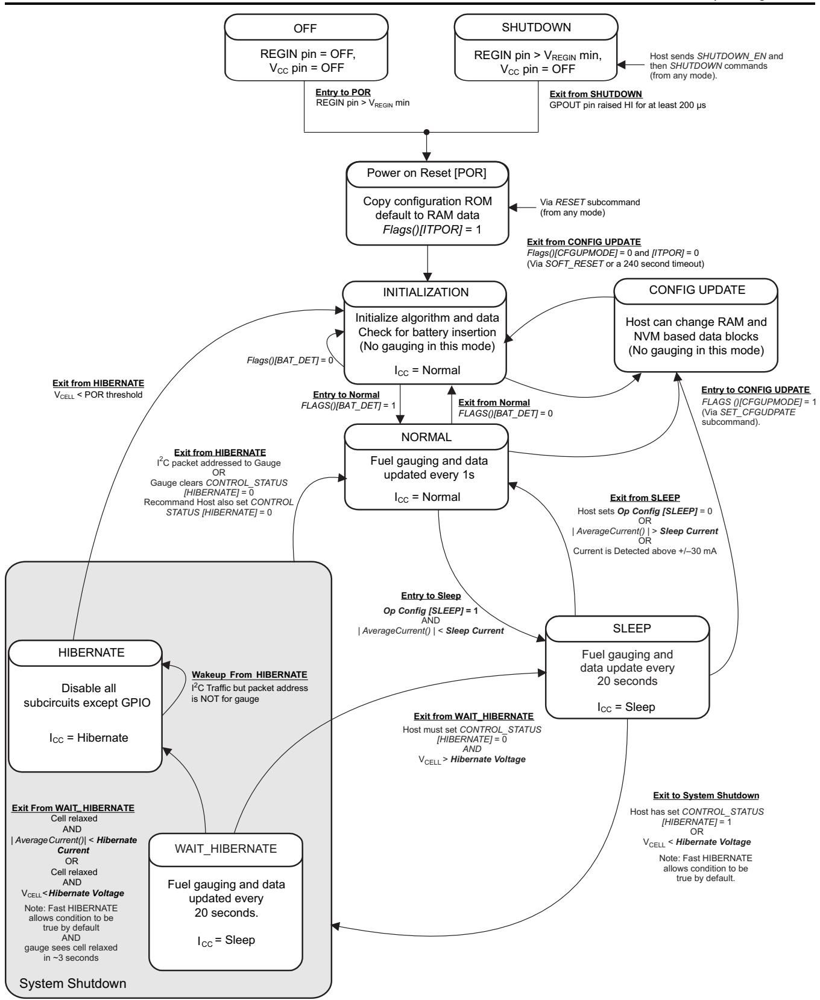
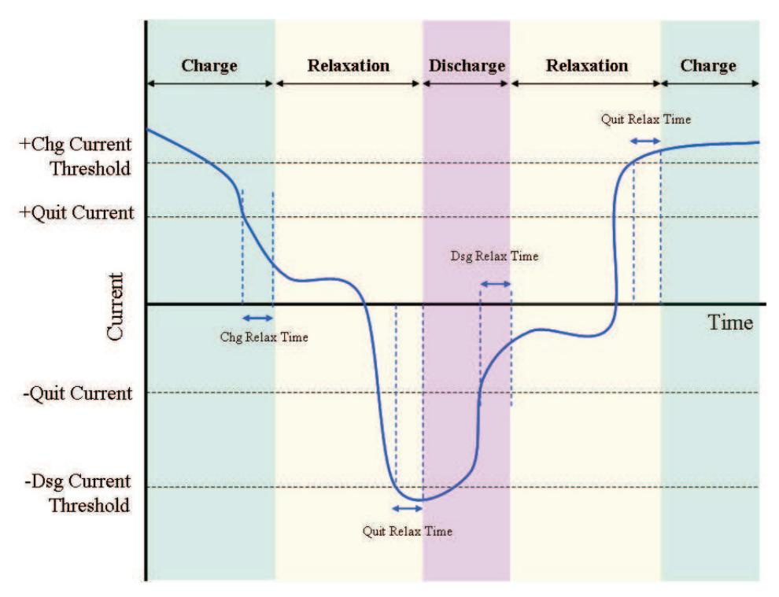

## **bq27441-G1**

# **Technical Reference**

Literature Number: SLUUAC9A December 2013–Revised May 2015

## **Contents**

| Pref | ace  |                                           | 4  |
|------|------|-------------------------------------------|----|
| 1    | Gene | eral Description                          | 6  |
| 2    | Func | ctional Description                       | 8  |
| -    | 2.1  | Fuel Gauging                              |    |
|      | 2.2  | Temperature Measurement                   |    |
|      | 2.3  | Current Measurement                       |    |
|      | 2.3  | Operating Modes                           |    |
|      | 2.4  | 2.4.1 SHUTDOWN Mode                       |    |
|      |      | 2.4.1 Shotbown Mode                       |    |
|      |      |                                           |    |
|      |      | 2.4.3 CONFIG UPDATE Mode                  |    |
|      |      | 2.4.4 NORMAL Mode                         |    |
|      |      | 2.4.5 SLEEP Mode                          |    |
|      |      | 2.4.6 HIBERNATE Mode                      |    |
|      | 2.5  | Pin Descriptions                          |    |
|      |      | 2.5.1 GPOUT Pin                           |    |
|      |      | 2.5.2 Battery Detection (BIN)             |    |
| 3    | Appl | lication Examples1                        | 14 |
|      | 3.1  | Data Memory Parameter Update Example      | 14 |
| 4    | Stan | dard Commands1                            | 16 |
|      | 4.1  | Control(): 0x00 and 0x01                  | 17 |
|      |      | 4.1.1 CONTROL STATUS: 0x0000              | 18 |
|      |      | 4.1.2 DEVICE TYPE: 0x0001                 | 18 |
|      |      | 4.1.3 FW VERSION: 0x0002                  |    |
|      |      | 4.1.4 DM CODE: 0x0004                     |    |
|      |      | 4.1.5 PREV MACWRITE: 0x0007               |    |
|      |      | 4.1.6 CHEM ID: 0x0008                     |    |
|      |      | 4.1.7 BAT INSERT: 0X000C                  |    |
|      |      | 4.1.8 BAT REMOVE: 0X000D                  |    |
|      |      | 4.1.9 SET HIBERNATE: 0x0011               |    |
|      |      | 4.1.10 CLEAR HIBERNATE: 0x0012            |    |
|      |      | 4.1.11 SET CFGUPDATE: 0x0013              |    |
|      |      | 4.1.12 SHUTDOWN ENABLE: 0x001B            |    |
|      |      | 4.1.13 SHUTDOWN: 0x001C                   |    |
|      |      |                                           |    |
|      |      |                                           |    |
|      |      | 4.1.15 PULSE_SOC_INT: 0x0023              |    |
|      |      |                                           | 20 |
|      |      | 4.1.17 SOFT_RESET: 0x0042                 |    |
|      |      | 4.1.18 EXIT_CFGUPDATE: 0x0043             |    |
|      |      | 4.1.19 EXIT_RESIM: 0x0044                 |    |
|      | 4.2  | Temperature(): 0x02 and 0x03              |    |
|      | 4.3  | Voltage(): 0x04 and 0x05                  |    |
|      | 4.4  | Flags(): 0x06 and 0x07                    |    |
|      | 4.5  | NominalAvailableCapacity(): 0x08 and 0x09 |    |
|      | 4.6  | FullAvailableCapacity(): 0x0A and 0x0B    | 21 |

#### www.ti.com

|       | 4.7    | RemainingCapacity(): 0x0C and 0x0D             | 21        |
|-------|--------|------------------------------------------------|-----------|
|       | 4.8    | FullChargeCapacity(): 0x0E and 0x0F            | 22        |
|       | 4.9    | AverageCurrent(): 0x10 and 0x11                | 22        |
|       | 4.10   | StandbyCurrent(): 0x12 and 0x13                | 22        |
|       | 4.11   | MaxLoadCurrent(): 0x14 and 0x15                | 22        |
|       | 4.12   | AveragePower(): 0x18 and 0x19                  | 22        |
|       | 4.13   | StateOfCharge(): 0x1C and 0x1D                 | 22        |
|       | 4.14   | InternalTemperature(): 0x1E and 0x1F           | 22        |
|       | 4.15   | StateOfHealth(): 0x20 and 0x21                 | 23        |
|       | 4.16   | RemainingCapacityUnfiltered(): 0x28 and 0x29   | 23        |
|       | 4.17   | RemainingCapacityFiltered(): 0x2A and 0x2B     | 23        |
|       | 4.18   | FullChargeCapacityUnfiltered(): 0x2C and 0x2D  | 23        |
|       | 4.19   | FullChargeCapacityFiltered(): 0x2E and 0x2F    | 23        |
|       | 4.20   | StateOfChargeUnfiltered(): 0x30 and 0x31       | 23        |
| 5     | Exten  | ided Data Commands                             | 25        |
| -     | 5.1    | OpConfig(): 0x3A and 0x3B                      |           |
|       | 5.2    | DesignCapacity(): 0x3C and 0x3D                |           |
|       | 5.3    | DataClass(): 0x3E                              |           |
|       | 5.4    | DataBlock(): 0x3F                              |           |
|       | 5.5    | BlockData(): 0x40 through 0x5F                 |           |
|       | 5.6    | BlockDataChecksum(): 0x60                      |           |
|       | 5.7    | BlockDataControl(): 0x61                       |           |
|       | 5.8    | Reserved – 0x62 through 0x7F                   |           |
| 6     |        | Memory                                         |           |
| 0     | 6.1    | Data Memory Interface                          |           |
|       | 0.1    | 6.1.1 Accessing the Data Memory                |           |
|       |        | 6.1.2 Access Modes                             |           |
|       |        | 6.1.3 SEALING and UNSEALING Data Memory Access |           |
|       | 6.2    | Data Types Summary                             |           |
|       | 6.3    | bq27441 Data Memory Summary Tables             |           |
|       | 6.4    | bq27441 Data Memory Parameter Descriptions     |           |
|       | 0.4    | 6.4.1 Configuration Class                      |           |
|       |        | · ·                                            |           |
|       |        | 6.4.2 Gas (Fuel) Gauging Class                 |           |
|       |        | 6.4.3 Ra Table Class                           |           |
|       |        | 6.4.4 Calibration Class                        |           |
|       |        | 6.4.5 Security Class                           |           |
| Revis | ion Hi | story                                          | <b>53</b> |

## *Preface*

This document is a detailed Technical Reference Manual (TRM) for using and configuring the bq27441-G1 battery fuel gauge. This TRM document is intended to complement but not supersede information in the separate bq27441-G1 datasheet.

## **Formatting Conventions used in this Document:**

| Information Type        | Formatting Convention                           | Example                     |  |
|-------------------------|-------------------------------------------------|-----------------------------|--|
| Commands                | Italics with parentheses and no breaking spaces | RemainingCapacity() command |  |
| Data Memory             | Italics, bold, and breaking spaces              | Design Capacity data        |  |
| Register bits and flags | Brackets and italics                            | [SOC1] bit                  |  |
| Data Memory bits        | Brackets, italics, and bold                     | [TEMPS] bit                 |  |
| Modes and states        | ALL CAPITALS                                    | UNSEALED mode               |  |

#### **Related Documentation from Texas Instruments**

To obtain a copy of any of the following TI documents, call the Texas Instruments Literature Response Center at (800) 477-8924 or the Support Center at (512) 434-1560. When ordering, identify this document by its title and literature number. Updated documents also can be obtained through the TI Web site at [www.ti.com](http://www.ti.com).

- 1. *bq27441-G1, System-Side Impedance Track™ Fuel Gauge* Data Sheet [\(SLUSBH1\)](http://www.ti.com/lit/pdf/SLUSAT1)
- 2. *Quickstart Guide for bq27441-G1* [\(SLUUAP7\)](http://www.ti.com/lit/pdf/SLUUAP7)
- 3. *bq27441 EVM: System-Side Impedance Track™ Technology* User's Guide [\(SLUUAP4\)](http://www.ti.com/lit/pdf/SLUUAP4)

## **Trademarks**

Impedance Track is a trademark of Texas Instruments. All other trademarks are the property of their respective owners.

## *General Description*

The bq27441-G1 battery fuel gauge accurately predicts the battery capacity and other operational characteristics of a single, Li-based, rechargeable cell. It can be interrogated by a system processor to provide cell information, such as state-of-charge (SOC). The device is orderable in two predefined standard configurations:

- The bq27441-G1A fuel gauge is predefined for LiCoO2 -based batteries for 4.2-V maximum charge voltage.
- • The bq27441-G1B fuel gauge is predefined for LiCoO2 -based batteries for 4.3-V or 4.35-V maximum charge voltage.

Unlike some other Impedance Track™ fuel gauges, the bq27441-G1 cannot be programmed with specific battery chemistry profiles. For many battery types and applications, the predefined standard chemistry profiles available in the bq27441-G1A or bq27441-G1B fuel gauge are sufficient matches from a gauging perspective.

Information is accessed through a series of commands, called *Standard Commands*. Further capabilities are provided by the additional *Extended Commands* set. Both sets of commands, indicated by the general format *Command()*, are used to read and write information contained within the control and status registers, as well as its data locations. Commands are sent from the system to the gauge using the I 2C serial communications engine, and can be executed during application development, system manufacture, or end-equipment operation.

The key to the high-accuracy, fuel gauging prediction is Texas Instruments proprietary Impedance Track™ algorithm. This algorithm uses cell measurements, characteristics, and properties to create SOC predictions that can achieve high accuracy across a wide variety of operating conditions and over the lifetime of the battery.

The fuel gauge measures the charging and discharging of the battery by monitoring the voltage across a small-value, external sense resistor. Cell impedance is computed based on current, open-circuit voltage (OCV), and cell voltage under loading conditions.

The fuel gauge uses an integrated temperature sensor for estimating cell temperature. Alternatively, the system processor can provide temperature data for the fuel gauge.

To minimize power consumption, the fuel gauge has several power modes: INITIALIZATION, NORMAL, SLEEP, HIBERNATE, and SHUTDOWN. The fuel gauge passes automatically between these modes, depending upon the occurrence of specific events, though a system processor can initiate some of these modes directly.

[www.ti.com](http://www.ti.com)

## *Functional Description*

## **2.1 Fuel Gauging**

The bq27441-G1 battery fuel gauge measures the cell voltage, temperature, and current to determine battery SOC. The fuel gauge monitors the charging and discharging of the battery by sensing the voltage across a small-value, external sense resistor (10 mΩ, typical) between the SRN and SRP pins. By integrating the charge passing through the battery, the battery SOC is adjusted during the charging or discharging of the battery.

The total battery capacity is found by comparing states of charge before and after applying the load with the amount of charge passed. When an application load is applied, the impedance of the cell is measured by comparing the OCV obtained from a predefined function for the present SOC with the measured voltage under load. Measurements of OCV and charge integration determine chemical SOC and chemical capacity (Qmax). The initial value for Qmax is defined by *Design Capacity* and should match the cell manufacturers' data sheet. The fuel gauge acquires and updates the battery-impedance profile during normal battery usage. The impedance profile, SOC, and the Qmax value are used to determine *FullChargeCapacity()* and *StateOfCharge()*, specifically for the present load and temperature. *FullChargeCapacity()* is reported as capacity available from a fully-charged battery under the present load and temperature until *Voltage()* reaches the *Terminate Voltage*. *NominalAvailableCapacity()* and *FullAvailableCapacity()* are the uncompensated (no or light load) versions of *RemainingCapacity()* and *FullChargeCapacity()*, respectively.

The fuel gauge has two flags, *[SOC1]* and *[SOCF]*, accessed by the *Flags()* command that warn when the battery SOC has fallen to critical levels. When *StateOfCharge()* falls below the first capacity threshold, as specified in *SOC1 Set Threshold*, the *[SOC1]* (state-of-charge initial) flag is set. The flag is cleared once *StateOfCharge()* rises above *SOC1 Set Threshold*. All units are in mAh.

When *StateOfCharge()* falls below the second capacity threshold, *SOCF Set Threshold*, the *[SOCF]* (state-of-charge final) flag is set, serving as a final discharge warning. If *SOCF Set Threshold* = –1, the flag is inoperative during discharge. Similarly, when *StateOfCharge()* rises above *SOCF Clear Threshold* and the *[SOCF]* flag has already been set, the *[SOCF]* flag is cleared. All units are in %.

#### **2.2 Temperature Measurement**

The fuel gauge measures temperature via its internal on-chip sensor. This internal temperature data will be used by the Impedance Track™ algorithm if the *OpConfig [TEMPS]* bit is cleared. Alternatively, if the *OpConfig [TEMPS]* bit is set, the system processor can set the temperature for the fuel gauging algorithm by writing to the *Temperature()* register.

Regardless of which sensor is used for measurement, the system processor can request the current battery temperature being used by the algorithm by calling the *Temperature()* function.

#### **2.3 Current Measurement**

The fuel gauge measures current by sensing the voltage across a small-value, external sense resistor (10 mΩ, typical) between the SRN and SRP pins. Internally, voltage passes through a gain stage before conversion by the coulomb counter. The current measurement data is available via the *AverageCurrent()* command.

[www.ti.com](http://www.ti.com) *Operating Modes*

## **2.4 Operating Modes**

The fuel gauge has different operating modes: POR, INITIALIZATION, NORMAL, CONFIG UPDATE, SLEEP, and HIBERNATE. Upon powering up from OFF or SHUTDOWN, a power-on reset (POR) occurs and the fuel gauge begins INITIALIZATION. In NORMAL mode, the fuel gauge is fully powered and can execute any allowable task. Configuration data in RAM can be updated by the host using the CONFIG UPDATE mode. In SLEEP mode, the fuel gauge turns off the high-frequency oscillator clock to enter a reduced-power state, periodically taking measurements and performing calculations. In HIBERNATE mode, the fuel gauge is in a very-low-power state, but can be woken up by communication.

### *2.4.1 SHUTDOWN Mode*

In SHUTDOWN mode, the LDO output is disabled so internal power and all RAM-based volatile data are lost. The host can command the gauge to immediately enter SHUTDOWN mode by first enabling the mode with a *SHUTDOWN\_ENABLE* subcommand ([Section](#page-18-6) 4.1.12) followed by the *SHUTDOWN* subcommand [\(Section](#page-18-7) 4.1.13). To exit SHUTDOWN mode, the GPOUT pin must be raised from logic low to logic high for at least 200 µs.

#### *2.4.2 POR and INITIALIZATION Modes*

Upon POR, the fuel gauge copies ROM-based configuration defaults to RAM and begins INITIALIZATION mode where essential data is initialized. It will remain in INITIALIZATION mode as a halted-CPU state when an adapter or other power source is present to power the fuel gauge (and system), yet no battery has been detected. The occurrence of POR or a *Control() RESET* subcommand will set the *Flags() [ITPOR]* status bit to indicate that RAM has returned to ROM default data.

When battery insertion is detected, a series of initialization activities begin including an OCV measurement. In addition, the *CONTROL\_STATUS [QMAX\_UP]* and *[RES\_UP]* bits are cleared to allow unfiltered learning of Qmax and impedance. Completion of INITIALIZATION mode is indicated by the *CONTROL\_STATUS [INITCOMP]* bit.

#### *2.4.3 CONFIG UPDATE Mode*

If the application requires different configuration data for the fuel gauge, the system processor can update RAM-based Data Memory parameters using the *Control() SET\_CFGUPDATE* subcommand to enter the CONFIG UPDATE mode. Operation in this mode is indicated by the *Flags() [CFGUPMODE]* status bit. In this mode, fuel gauging is suspended while the host uses the extended data commands to modify the configuration data blocks.

To resume fuel gauging, the host sends a *Control() SOFT\_RESET*, *EXIT\_CFGUPMODE*, or *EXIT\_RESIM* subcommand to exit the CONFIG UPDATE mode which clears both *Flags() [ITPOR]* and *[CFGUPMODE]* bits. After a timeout of approximately 240 seconds (4 minutes), the gauge will automatically exit the CONFIG UPDATE mode if it has not received a *SOFT\_RESET*, *EXIT\_CFGUPMODE*, or *EXIT\_RESIM* subcommand from the host.

## *2.4.4 NORMAL Mode*

The fuel gauge is in NORMAL mode when not in any other power mode. During this mode, *AverageCurrent()*, *Voltage(),* and *Temperature()* measurements are taken once per second, and the interface data set is updated. Decisions to change states are also made. This mode is exited by activating a different power mode.

Because the gauge consumes the most power in NORMAL mode, the Impedance Track™ algorithm minimizes the time the fuel gauge remains in this mode.

*Operating Modes* [www.ti.com](http://www.ti.com)

## *2.4.5 SLEEP Mode*

SLEEP mode is entered automatically if the feature is enabled (*OpConfig [SLEEP]* = 1) and *AverageCurrent()* is below the programmable level *Sleep Current* (default = 10 mA). Once entry into SLEEP mode has been qualified, but prior to entering it, the fuel gauge performs an ADC autocalibration to minimize the offset.

During SLEEP mode, the fuel gauge remains in a very-low-power idle state and automatically wakes up briefly every 20 seconds to take data measurements.

After taking the measurements on the 20-second interval, the fuel gauge will exit SLEEP mode when *AverageCurrent()* rises above *Sleep Current* (default = 10 mA). Alternatively, an early wake-up before the 20-second internal is possible if the instantaneous current detected by an internal hardware comparator is above an approximate threshold of ±30 mA.

#### *2.4.6 HIBERNATE Mode*

HIBERNATE mode could be used when the system equipment needs to enter a very-low-power state, and minimal gauge power consumption is required. This mode is ideal when system equipment is set to its own HIBERNATE, SHUTDOWN, or OFF mode.

Before the fuel gauge can enter HIBERNATE mode, the system must use the *SET\_HIBERNATE* subcommand to set the *[HIBERNATE]* bit of the *CONTROL\_STATUS* register. The fuel gauge waits to enter HIBERNATE mode until it has taken a valid OCV measurement and the magnitude of the average cell current has fallen below *Hibernate Current*. The fuel gauge can also enter HIBERNATE mode if the cell voltage falls below the *Hibernate Voltage*. The fuel gauge will remain in HIBERNATE mode until the system issues a direct I 2C command to the fuel gauge. I 2C communication that is not directed to the fuel gauge will only briefly wake it up and the fuel gauge immediately returns to HIBERNATE mode.

It is the responsibility of the system to wake the fuel gauge after it has gone into HIBERNATE mode and to prevent a charger from charging the battery before the *Flags() [OCVTAKEN]* bit is set which signals an initial OCV reading has been taken. For maximum initialization accuracy, any significant charge or discharge current should be postponed until the *CONTROL\_STATUS [INITCOMP]* bit is set. This could take up to 10 seconds. After waking, the fuel gauge can proceed with the initialization of the battery information. During HIBERNATE mode, RAM-based data values are maintained, but gauging status is lost. Upon exit from HIBERNATE mode, the fuel gauge will immediately reacquire measurements and reinitialize all gauging predictions.

[www.ti.com](http://www.ti.com) *Operating Modes*

**Figure 2-1. Power Mode Diagram**

*Pin Descriptions* [www.ti.com](http://www.ti.com)

## **2.5 Pin Descriptions**

#### *2.5.1 GPOUT Pin*

The GPOUT pin is a multiplexed pin and the polarity of the pin output can be selected via the *OpConfig [GPIOPOL]* bit. The function is defined by *OpConfig [BATLOWEN]* bit. If the bit is set, the Battery Low Indicator (BAT\_LOW) function is selected for the GPOUT pin. If cleared, the SOC interrupt (SOC\_INT) function is selected for the GPOUT pin.

When the BAT\_LOW function is activated, the signaling on the multiplexed pin follows the status of the *[SOC1]* bit in the *Flags()* register. The fuel gauge has two flags accessed by the *Flags()* function that warn when the battery SOC has fallen to critical levels. When *StateOfCharge()* falls below the first capacity threshold, specified in *SOC1 Set Threshold*, the *[SOC1]* flag is set. The flag is cleared once *StateOfCharge()* rises above *SOC1 Set Threshold*. The GPOUT pin automatically reflects the status of the *[SOC1]* flag when *[BATLOWEN]* = 1 and *[GPIOPOL]* = 0. The polarity can be flipped by setting *[GPIOPOL]* = 1.

When *StateOfCharge()* falls below the second capacity threshold, *SOCF Set Threshold*, the *[SOCF]* flag is set, serving as a final discharge warning. Similarly, when *StateOfCharge()* rises above *SOCF Clear Threshold* and the *[SOCF]* flag has already been set, the *[SOCF]* flag is cleared.

When the SOC\_INT function is activated, the GPOUT pin generates 1-ms pulse width under various conditions as described in [Table](#page-11-3) 2-1.

|                                                                                                                 | Enable Condition | Pulse Width                                                                                                               | Description                                                                                                                                                                                                                                                                                                                                                                                                                                                                             |
|-----------------------------------------------------------------------------------------------------------------|------------------|---------------------------------------------------------------------------------------------------------------------------|-----------------------------------------------------------------------------------------------------------------------------------------------------------------------------------------------------------------------------------------------------------------------------------------------------------------------------------------------------------------------------------------------------------------------------------------------------------------------------------------|
| Change in SOC                                                                                                | (SOCI Delta) ≠ 0 | 1 ms                                                                                                                      | During charge, when the SOC is greater than (>) the points: 100% – n × (SOCI Delta) and 100%; During discharge, when the SOC reaches (≤) the points: 100% – n × (SOCI Delta) and 0%; where n is an integer starting from 0 to the number generating SOC no less than 0%. Examples: For SOCI Delta = 1% (default), the SOC_INT intervals are 0%, 1%, 2%, …, 99%, and 100%. For SOCI Delta = 10%, the SOC_INT intervals are 0%, 10%, 20%, …, 90%, and 100%. |
| State Change                                                                                                    | (SOCI Delta) ≠ 0 | 1 ms                                                                                                                      | Upon detection of entry to a charge or a discharge state. Relaxation is not included.                                                                                                                                                                                                                                                                                                                                                                                                |
| Battery OpConfig [BIE] bit 1 ms When battery removal is detected by the BIN pin. Removal is set. |                  |                                                                                                                           |                                                                                                                                                                                                                                                                                                                                                                                                                                                                                         |
| Initialization Always 1 ms Complete                                                                    |                  | After initial gauge predictions are updated upon exit from POR or HIBERNATE, the CONTROL_STATUS [INITCOMP] bit is set. |                                                                                                                                                                                                                                                                                                                                                                                                                                                                                         |

**Table 2-1. SOC\_INT Function Definition**

#### *2.5.2 Battery Detection (BIN)*

The function of the *OpConfig [BIE]* bit is described in [Table](#page-11-4) 2-2. When battery insertion is detected and the INITIALIZATION mode is completed, the fuel gauge transitions to NORMAL mode to start Impedance Track™ fuel gauging. When battery insertion is not detected, the fuel gauge remains in INITIALIZATION mode.

*OpConfig [BIE]* **Battery Insertion Requirement Battery Removal Requirement** 1 (1) Host drives BIN pin from logic high to low to (1) Host drives the BIN pin from logic low to high signal battery insertion. to signal battery removal. or or (2) A weak pullup resistor can be used (between (2) When a battery pack with a pulldown resistor the BIN and VCC pins). When a battery pack with is removed, the weak pullup resistor can a pulldown resistor is connected, it can generate generate a logic high to signal battery removal. a logic low to signal battery insertion. 0 Host sends *BAT\_INSERT* subcommand to Host sends *BAT\_REMOVE* subcommand to signal battery insertion. signal battery removal.

**Table 2-2. Battery Detection**

[www.ti.com](http://www.ti.com) *Pin Descriptions*

## Application Examples

## 3.1 Data Memory Parameter Update Example

This following example shows the command sequence needed to modify a Data Memory parameter. For this example, the default **Design Capacity** is updated from 1000 mAh to 1200 mAh. All device writes (wr) and reads (rd) are implied to the  $I^2C$  8-bit addresses 0xAA and 0xAB, respectively.

| Step | Step Description                                                                                                                                                                                                                                                                                                                                                                                                                                                 | Pseudo Code                                                                                                                                                                |
|------|------------------------------------------------------------------------------------------------------------------------------------------------------------------------------------------------------------------------------------------------------------------------------------------------------------------------------------------------------------------------------------------------------------------------------------------------------------------|----------------------------------------------------------------------------------------------------------------------------------------------------------------------------|
| 1    | If the device has been previously SEALED, UNSEAL it by sending the appropriate keys to <i>Control()</i> (0x00 and 0x01). Write the first 2 bytes of the UNSEAL key using the <i>Control(0x8000)</i> command. Without writing any other bytes to the device, write the second (identical) 2 bytes of the UNSEAL key using the <i>Control(0x8000)</i> command.  Note: The remaining steps in this table use this single-packet method when writing multiple bytes. | //Two-byte incremental Method wr 0x00 0x00 0x80; wr 0x00 0x00 0x80; //Alternative single byte method wr 0x00 0x00; wr 0x01 0x80; wr 0x00 0x00; wr 0x01 0x80; wr 0x01 0x80; |
| 2    | Send SET_CFGUPDATE subcommand, Control(0x0013)                                                                                                                                                                                                                                                                                                                                                                                                                   | wr 0x00 0x13 0x00;                                                                                                                                                         |
| 3    | Confirm CFGUPDATE mode by polling <i>Flags()</i> register until bit 4 is set. May take up to 1 second.                                                                                                                                                                                                                                                                                                                                                           | rd 0x06 Flags_register;                                                                                                                                                    |
| 4    | Write 0x00 using <i>BlockDataControl()</i> command (0x61) to enable block data memory control.                                                                                                                                                                                                                                                                                                                                                                   | wr 0x61 0x00;                                                                                                                                                              |
| 5    | Write 0x52 using the <i>DataBlockClass()</i> command (0x3E) to access the State subclass (82 decimal, 0x52 hex) containing the <i>Design Capacity</i> parameter.                                                                                                                                                                                                                                                                                                 | wr 0x3E 0x52;                                                                                                                                                              |
| 6    | Write the block offset location using <code>DataBlock()</code> command (0x3F). <b>Note</b> : To access data located at offset 0 to 31, use offset = 0x00. To access data located at offset 32 to 41, use offset = 0x01.                                                                                                                                                                                                                                          | wr 0x3F 0x00;                                                                                                                                                              |
| 7    | Read the 1-byte checksum using the <i>BlockDataChecksum()</i> command (0x60). Expect 0xE8 for -G1B checksum.                                                                                                                                                                                                                                                                                                                                                     | rd 0x60 OLD_Csum;                                                                                                                                                          |
| 8    | Read both <i>Design Capacity</i> bytes starting at 0x4A (offset = 10). Block data starts at 0x40, so to read the data of a specific offset, use address 0x40 + mod(offset, 32). Expect 0x03 0xE8 for -G1B for a 1000-mAh default value.  Note: LSB byte is coincidentally the same value as the checksum.                                                                                                                                                        | rd 0x4A OLD_DesCap_MSB; rd 0x4B OLD_DesCap_LSB;                                                                                                                         |
| 9    | Write both <b>Design Capacity</b> bytes starting at 0x4A (offset = 10). For this example, the new value is 1200 mAh. (0x04B0 hex)                                                                                                                                                                                                                                                                                                                                | wr 0x4A 0x04; wr 0x4B 0xB0;                                                                                                                                             |
| 10   | Compute the new block checksum. The checksum is $(255 - x)$ where x is the 8-bit summation of the $BlockData()$ (0x40 to 0x5F) on a byte-by-byte basis. A quick way to calculate the new checksum uses a data replacement method with the old and new data summation bytes. Refer to the code for the indicated method.                                                                                                                                          | temp = mod(255 - OLD_Csum - OLD_DesCap_MSB - OLD_DesCap_LSB, 256); NEW_Csum = 255 - mod(temp + + 0x04 + 0xB0, 256);                                            |
| 11   | Write new checksum. The data is actually transferred to the Data Memory when the correct checksum for the whole block (0x40 to 0x5F) is written to <i>BlockDataChecksum()</i> (0x60). For this example New_Csum is 0x1F.                                                                                                                                                                                                                                         | wr 0x60 New_Csum; //Example: wr 0x60 0x1F                                                                                                                               |
| 12   | Exit CFGUPDATE mode by sending SOFT_RESET subcommand, Control(0x0042)                                                                                                                                                                                                                                                                                                                                                                                            | wr 0x00 0x42 0x00;                                                                                                                                                         |
| 13   | Confirm CFGUPDATE has been exited by polling <i>Flags()</i> register until bit 4 is cleared. May take up to 1 second.                                                                                                                                                                                                                                                                                                                                            | rd 0x06 Flags_register;                                                                                                                                                    |
| 14   | If the device was previously SEALED, return to SEALED mode by sending the <i>Control(0x0020)</i> subcommand.                                                                                                                                                                                                                                                                                                                                                     | wr 0x00 0x20 0x00;                                                                                                                                                         |

## *Standard Commands*

The fuel gauge uses a series of 2-byte standard commands to enable system reading and writing of battery information. Each standard command has an associated command-code pair as indicated in [Table](#page-15-1) 4-1. Because each command consists of two bytes of data, two consecutive I 2C transmissions must be executed both to initiate the command function and to read or write the corresponding two bytes of data.

**Table 4-1. Standard Commands**

| Name                           | Command Code | Unit          | SEALED Access |    |
|--------------------------------|-----------------|---------------|---------------|----|
| Control()                      | CNTL            | 0x00 and 0x01 | NA            | RW |
| Temperature()                  | TEMP            | 0x02 and 0x03 | 0.1°K         | RW |
| Voltage()                      | VOLT            | 0x04 and 0x05 | mV            | R  |
| Flags()                        | FLAGS           | 0x06 and 0x07 | NA            | R  |
| NominalAvailableCapacity()     |                 | 0x08 and 0x09 | mAh           | R  |
| FullAvailableCapacity()        |                 | 0x0A and 0x0B | mAh           | R  |
| RemainingCapacity()            | RM              | 0x0C and 0x0D | mAh           | R  |
| FullChargeCapacity()           | FCC             | 0x0E and 0x0F | mAh           | R  |
| AverageCurrent()               |                 | 0x10 and 0x11 | mA            | R  |
| StandbyCurrent()               |                 | 0x12 and 0x13 | mA            | R  |
| MaxLoadCurrent()               |                 | 0x14 and 0x15 | mA            | R  |
| AveragePower()                 |                 | 0x18 and 0x19 | mW            | R  |
| StateOfCharge()                | SOC             | 0x1C and 0x1D | %             | R  |
| InternalTemperature()          |                 | 0x1E and 0x1F | 0.1°K         | R  |
| StateOfHealth()                | SOH             | 0x20 and 0x21 | num / %       | R  |
| RemainingCapacityUnfiltered()  |                 | 0x28 and 0x29 | mAh           | R  |
| RemainingCapacityFiltered()    |                 | 0x2A and 0x2B | mAh           | R  |
| FullChargeCapacityUnfiltered() |                 | 0x2C and 0x2D | mAh           | R  |
| FullChargeCapacityFlitered()   |                 | 0x2E and 0x2F | mAh           | R  |
| StateOfChargeUnfiltered()      |                 | 0x30 and 0x31 | mAh           | R  |

## **4.1 Control(): 0x00 and 0x01**

Issuing a *Control()* command requires a subsequent 2-byte subcommand. These additional bytes specify the particular control function desired. The *Control()* command allows the system to control specific features of the fuel gauge during normal operation and additional features when the device is in different access modes as described in [Table](#page-16-1) 4-2.

**Table 4-2.** *Control()* **Subcommands**

| Control Function | Control Data | SEALED Access | Description                                                                                                                              |
|------------------|--------------|---------------|------------------------------------------------------------------------------------------------------------------------------------------|
| CONTROL_STATUS   | 0x0000       | Yes           | Reports the status of device.                                                                                                            |
| DEVICE_TYPE      | 0x0001       | Yes           | Reports the device type (0x0421).                                                                                                        |
| FW_VERSION       | 0x0002       | Yes           | Reports the firmware version of the device.                                                                                              |
| DM_CODE          | 0x0004       | Yes           | Reports the Data Memory Code number stored in NVM.                                                                                       |
| PREV_MACWRITE    | 0x0007       | Yes           | Returns previous MAC command code.                                                                                                       |
| CHEM_ID          | 0x0008       | Yes           | Reports the chemical identifier of the battery profile used by the fuel gauge.                                                        |
| BAT_INSERT       | 0x000C       | Yes           | Forces the Flags() [BAT_DET] bit set when the OpConfig [BIE] bit is 0.                                                                |
| BAT_REMOVE       | 0x000D       | Yes           | Forces the Flags() [BAT_DET] bit clear when the OpConfig [BIE] bit is 0.                                                              |
| SET_HIBERNATE    | 0x0011       | Yes           | Forces CONTROL_STATUS [HIBERNATE] bit to 1.                                                                                              |
| CLEAR_HIBERNATE  | 0x0012       | Yes           | Forces CONTROL_STATUS [HIBERNATE] bit to 0.                                                                                              |
| SET_CFGUPDATE    | 0x0013       | No            | Forces Flags() [CFGUPMODE] bit to 1 and gauge enters CONFIG UPDATE mode.                                                              |
| SHUTDOWN_ENABLE  | 0x001B       | No            | Enables device SHUTDOWN mode.                                                                                                            |
| SHUTDOWN         | 0x001C       | No            | Commands the device to enter SHUTDOWN mode.                                                                                              |
| SEALED           | 0x0020       | No            | Places the device in SEALED access mode.                                                                                                 |
| TOGGLE_GPOUT     | 0x0023       | Yes           | Commands the device to toggle the GPOUT pin for 1 ms.                                                                                    |
| RESET            | 0x0041       | No            | Performs a full device reset.                                                                                                            |
| SOFT_RESET       | 0x0042       | No            | Gauge exits CONFIG UPDATE mode.                                                                                                          |
| EXIT_CFGUPDATE   | 0x0043       | No            | Exits CONFIG UPDATE mode without an OCV measurement and without resimulating to update StateOfCharge().                               |
| EXIT_RESIM       | 0x0044       | No            | Exits CONFIG UPDATE mode without an OCV measurement and resimulates with the updated configuration data to update StateOfCharge(). |

*Control(): 0x00 and 0x01* [www.ti.com](http://www.ti.com)

## *4.1.1 CONTROL\_STATUS: 0x0000*

Instructs the fuel gauge to return status information to *Control()* addresses 0x00 and 0x01. The read-only status word contains status bits that are set or cleared either automatically as conditions warrant or through using specified subcommands.

**Table 4-3. CONTROL\_STATUS Bit Definitions**

|           | bit7       | bit6      | bit5 | bit4    | bit3 | bit2    | bit1    | bit0   |
|-----------|------------|-----------|------|---------|------|---------|---------|--------|
| High Byte | SHUTDOWNEN | WDRESET   | SS   | CALMODE | CCA  | BCA     | QMAX_UP | RES_UP |
| Low Byte  | INITCOMP   | HIBERNATE | RSVD | SLEEP   | LDMD | RUP_DIS | VOK     | RSVD   |

#### **High Byte**

SHUTDOWNEN = Indicates the fuel gauge has received the *SHUTDOWN\_ENABLE* subcommand and is enabled for SHUTDOWN. Active when set.

WDRESET = Indicates the fuel gauge has performed a Watchdog Reset. Active when set.

SS = Indicates the fuel gauge is in the SEALED state. Active when set.

CALMODE = Indicates the fuel gauge is in calibration mode. Active when set.

CCA = Indicates the fuel gauge Coulomb Counter Auto-Calibration routine is active. The CCA routine will take place approximately 3 minutes and 45 seconds after the initialization as well as periodically as conditions permit. Active when set.

BCA = Indicates the fuel gauge board calibration routine is active. Active when set.

QMAX\_UP = Indicates Qmax has updated. True when set. This bit is cleared after a POR or when the *Flags() [BAT\_DET]* bit is set. When this bit is cleared, it enables fast learning of battery Qmax.

RES\_UP = Indicates that resistance has been updated. True when set. This bit is cleared after a POR or when the *Flags() [BAT\_DET]* bit is set. Also, this bit can only be set after Qmax is updated (*[QMAX\_UP]* bit is set). When this bit is cleared, it enables fast learning of battery impedance.

#### **Low Byte**

INITCOMP = Initialization completion bit indicating the initialization is complete. True when set.

HIBERNATE = Indicates a request for entry into HIBERNATE from SLEEP mode has been issued. True when set.

RSVD = Reserved

SLEEP = Indicates the fuel gauge is in SLEEP mode. True when set.

LDMD = Indicates the algorithm is using constant-power model. True when set. Default is 1.

RUP\_DIS = Indicates the fuel gauge Ra table updates are disabled. Updates are disabled when set.

VOK = Indicates cell voltages are ok for Qmax updates. True when set.

RSVD = Reserved

## *4.1.2 DEVICE\_TYPE: 0x0001*

Instructs the fuel gauge to return the device type to addresses 0x00 and 0x01. The value returned is 0x0421. (Note: Value returned is 0x0421 even if the product is bq27441-G1 so the distinguishing identification requires both DEVICE\_TYPE and DM\_CODE)

## *4.1.3 FW\_VERSION: 0x0002*

Instructs the fuel gauge to return the firmware version to addresses 0x00 and 0x01.

## *4.1.4 DM\_CODE: 0x0004*

Instructs the fuel gauge to return the 8-bit *DM Code* as the least significant byte of the 16-bit return value at addresses 0x00 and 0x01. The *DM\_CODE* subcommand provides a simple method to determine the configuration code stored in Data Memory.

#### *4.1.5 PREV\_MACWRITE: 0x0007*

Instructs the fuel gauge to return the previous command written to addresses 0x00 and 0x01. The value returned is limited to less than 0x0015.

[www.ti.com](http://www.ti.com) *Control(): 0x00 and 0x01*

## *4.1.6 CHEM\_ID: 0x0008*

Instructs the fuel gauge to return the chemical identifier for the Impedance Track™ configuration to addresses 0x00 and 0x01. The expected value for bq27441-G1A is 0x0128 and for bq27441-G1B it is 0x0312.

#### *4.1.7 BAT\_INSERT: 0X000C*

Forces the *Flags() [BAT\_DET]* bit to set when the battery insertion detection is disabled via *OpConfig [BIE]* = 0. In this case, the gauge does not detect battery insertion from the BIN pin logic state, but relies on the *BAT\_INSERT* host subcommand to indicate battery presence in the system. This subcommand also starts Impedance Track™ gauging.

## *4.1.8 BAT\_REMOVE: 0X000D*

Forces the *Flags() [BAT\_DET]* bit to clear when the battery insertion detection is disabled via *OpConfig [BIE]* = 0. In this case, the gauge does not detect battery removal from the BIN pin logic state, but relies on the *BAT\_REMOVE* host subcommand to indicate battery removal from the system.

## *4.1.9 SET\_HIBERNATE: 0x0011*

Instructs the fuel gauge to force the *CONTROL\_STATUS [HIBERNATE]* bit to 1. If the necessary conditions are met, this enables the gauge to enter the HIBERNATE power mode after the transition to SLEEP power state is detected. The *[HIBERNATE]* bit is automatically cleared upon exiting from HIBERNATE mode.

## *4.1.10 CLEAR\_HIBERNATE: 0x0012*

Instructs the fuel gauge to force the *CONTROL\_STATUS [HIBERNATE]* bit to 0. This prevents the gauge from entering the HIBERNATE power mode after the transition to SLEEP power state is detected. It can also be used to force the gauge out of HIBERNATE mode.

#### *4.1.11 SET\_CFGUPDATE: 0x0013*

Instructs the fuel gauge to set the *Flags() [CFGUPMODE]* bit to 1 and enter CONFIG UPDATE mode. This command is only available when the fuel gauge is UNSEALED.

**NOTE:** A *SOFT\_RESET* subcommand is typically used to exit CONFIG UPDATE mode to resume normal gauging.

## *4.1.12 SHUTDOWN\_ENABLE: 0x001B*

Instructs the fuel gauge to enable SHUTDOWN mode and set the *CONTROL\_STATUS [SHUTDOWNEN]* status bit.

#### *4.1.13 SHUTDOWN: 0x001C*

Instructs the fuel gauge to immediately enter SHUTDOWN mode after receiving this subcommand. The SHUTDOWN mode is effectively a power-down mode with only a small circuit biased by the BAT pin which is used for wake-up detection. To enter SHUTDOWN mode, the *SHUTDOWN\_ENABLE* subcommand must have been previously received. To exit SHUTDOWN mode, the GPOUT pin must be raised from logic low to logic high for at least 200 µs.

#### *4.1.14 SEALED: 0x0020*

Instructs the fuel gauge to transition from UNSEALED state to SEALED state and will set bit 7 (0x80) in the *Update Status* register to 1. The fuel gauge should always be set to the SEALED state for use in end equipment. The SEALED state blocks accidental writes of specific subcommands (see [Table](#page-16-1) 4-2) and most Standard and Extended Commands (see [Table](#page-15-1) 4-1 and [Table](#page-24-5) 5-1, respectively).

*Control(): 0x00 and 0x01* [www.ti.com](http://www.ti.com)

## *4.1.15 PULSE\_SOC\_INT: 0x0023*

This subcommand can be useful for system level debug or test purposes. It instructs the fuel gauge to pulse the GPOUT pin for approximately 1 ms within 1 second of receiving the command.

**NOTE:** The GPOUT pin must be configured for the SOC\_INT output function with the *OpConfig*

*[BATLOWEN]* bit cleared.

## *4.1.16 RESET: 0x0041*

This command instructs the fuel gauge to perform a full device reset and reinitialize RAM data to the default values from ROM and is therefore not typically used in field operation. The gauge sets the *Flags() [ITPOR]* bit and enters the INITIALIZE mode. See [Figure](#page-10-0) 2-1. This command is only available when the fuel gauge is UNSEALED.

#### *4.1.17 SOFT\_RESET: 0x0042*

This subcommand instructs the fuel gauge to perform a partial (soft) reset from any mode with an OCV measurement. The *Flags() [ITPOR]* and *[CFGUPMODE]* bits are cleared and a resimulation occurs to update both *StateOfCharge()* and *StateOfChargeUnfiltered()*. See [Figure](#page-10-0) 2-1. Upon exit from CONFIG UPDATE mode, the fuel gauge will check bit 7 (0x80) in the *Update Status* register. If bit 7 (0x80) in the Update Status register is set, the fuel gauge will be placed into the SEALED state. This subcommand is only available when the fuel gauge is UNSEALED.

## *4.1.18 EXIT\_CFGUPDATE: 0x0043*

This subcommand exits CONFIG UPDATE mode without an OCV measurement and without resimulating to update *StateOfChargeUnfiltered()* or *StateOfCharge()*. The *Flags() [ITPOR]* and *[CFGUPMODE]* bits are cleared. Upon exit from CONFIG UPDATE mode, the fuel gauge will check bit 7 (0x80) in the *Update Status* register. If bit 7 (0x80) in the *Update Status* register is set the fuel gauge will be placed into the SEALED state.

If a new OCV measurement or resimulation is desired, either the *SOFT\_RESET* or *EXIT\_RESIM* subcommand should be used to exit CONFIG UPDATE mode. If EXIT\_CFGUPDATE subcommand has been used to exit CONFIG UPDATE mode, the *SOFT\_RESET* or *EXIT\_RESIM* subcommand will not provide a new OCV measurement and/or resimulation. To get the new OCV measurement and/or resimulation the fuel gauge must first be placed into CONFIG UPDATE mode (*SET\_CFGUPDATE* subcommand) and then the *SOFT\_RESET* or *EXIT\_RESIM* subcommand should be used to exit the CONFIG UPDATE mode. This subcommand is only available when the fuel gauge is UNSEALED.

## *4.1.19 EXIT\_RESIM: 0x0044*

This subcommand exits CONFIG UPDATE mode without an OCV measurement. The *Flags() [ITPOR]* and *[CFGUPMODE]* bits are cleared and a resimulation occurs to update *StateOfChargeUnfiltered()*. Upon exit from CONFIG UPDATE mode, the fuel gauge will check bit 7 (0x80) in the *Update Status* register. If bit 7 (0x80) in the *Update Status* register is set, the fuel gauge will be placed into the SEALED state. This subcommand is only available when the fuel gauge is UNSEALED.

#### **4.2 Temperature(): 0x02 and 0x03**

This read- and write-word function returns an unsigned integer value of the temperature in units of 0.1°K measured by the fuel gauge. If *OpConfig [TEMPS]* bit = 0 (default), a read command will return the internal temperature sensor value and a write command will be ignored. If *OpConfig [TEMPS]* bit = 1, a write command sets the temperature to be used for gauging calculations while a read command returns to the temperature previously written.

### **4.3 Voltage(): 0x04 and 0x05**

This read-only function returns an unsigned integer value of the measured cell-pack voltage in mV with a range of 0 to 6000 mV.

[www.ti.com](http://www.ti.com) *Flags(): 0x06 and 0x07*

## **4.4 Flags(): 0x06 and 0x07**

This read-word function returns the contents of the fuel gauging status register, depicting the current operating status.

**Table 4-4. Flags Bit Definitions**

|           | bit7     | bit6 | bit5  | bit4      | bit3    | bit2 | bit1 | bit0 |
|-----------|----------|------|-------|-----------|---------|------|------|------|
| High Byte | OT       | UT   | RSVD  | RSVD      | RSVD    | RSVD | FC   | CHG  |
| Low Byte  | OCVTAKEN | RSVD | ITPOR | CFGUPMODE | BAT_DET | SOC1 | SOCF | DSG  |

#### **High Byte**

- OT = Over-Temperature condition is detected. *[OT]* is set when *Temperature()* ≥ *Over Temp* (default = 55°C). *[OT]* is cleared when *Temperature()* < *Over Temp* – *Temp Hys*.
- UT = Under-Temperature condition is detected. *[UT]* is set when *Temperature()* ≤ *Under Temp* (default = 0°C). *[UT]* is cleared when *Temperature()* > *Under Temp* + *Temp Hys*.
- RSVD = Bits 5:2 are reserved.
  - FC = Full-charge is detected. If the *FC Set%* is a positive threshold, *[FC]* is set when SOC ≥ *FC Set %* and is cleared when SOC ≤ *FC Clear %* (default = 98%). By default, *FC Set%* = –1, therefore *[FC]* is set when the fuel gauge has detected charge termination.
- CHG = Fast charging allowed. If SOC changes from 98% to 99% during charging, the *[CHG]* bit is cleared. The *[CHG]* bit will become set again when SOC ≤ 95%.

#### **Low Byte**

- OCVTAKEN = Cleared on entry to relax mode and set to 1 when OCV measurement is performed in relax mode.
  - RSVD = Reserved.
  - ITPOR = Indicates a POR or *RESET* subcommand has occurred. If set, this bit generally indicates that the RAM configuration registers have been reset to default values and the host should reload the configuration parameters using the CONFIG UPDATE mode. This bit is cleared after the *SOFT\_RESET* subcommand is received.
- CFGUPMODE = Fuel gauge is in CONFIG UPDATE mode. True when set. Default is 0. Refer to [Section](#page-8-3) 2.4.3 for details.
  - BAT\_DET = Battery insertion detected. True when set. When *OpConfig [BIE]* is set, *[BAT\_DET]* is set by detecting a logic high-to-low transition at the BIN pin. When *OpConfig [BIE]* is low, *[BAT\_DET]* is set when host issues *BAT\_INSERT* subcommand and is cleared when host issues the *BAT\_REMOVE* subcommand. Gauge predictions are not valid unless *[BAT\_DET]* is set.
    - SOC1 = If set, *StateOfCharge()* ≤ *SOC1 Set Threshold*. The *[SOC1]* bit will remain set until *StateOfCharge()* ≥ *SOC1 Clear Threshold*.
    - SOCF = If set, *StateOfCharge()* ≤ *SOCF Set Threshold*. The *[SOCF]* bit will remain set until *StateOfCharge()* ≥ *SOCF Clear Threshold*.
    - DSG = Discharging detected. True when set.

## **4.5 NominalAvailableCapacity(): 0x08 and 0x09**

This read-only command pair returns the uncompensated (less than C/20 load) battery capacity remaining. Units are mAh.

#### **4.6 FullAvailableCapacity(): 0x0A and 0x0B**

This read-only command pair returns the uncompensated (less than C/20 load) capacity of the battery when fully charged. *FullAvailableCapacity()* is updated at regular intervals. Units are mAh.

#### **4.7 RemainingCapacity(): 0x0C and 0x0D**

This read-only command pair returns the remaining battery capacity compensated for load and temperature. If *OpConfigB [SMOOTHEN]* = 1, this register is equal to *RemainingCapacityFiltered()*; otherwise, it is equal to *RemainingCapacityUnfiltered()*. Units are mAh.

## **4.8 FullChargeCapacity(): 0x0E and 0x0F**

This read-only command pair returns the compensated capacity of the battery when fully charged. *FullChargeCapacity()* is updated at regular intervals and is compensated for load and temperature. If *OpConfigB [SMOOTHEN]* = 1, this register is equal to *FullChargeCapacityFiltered()*; otherwise, it is equal to *FullChargeCapacityUnfiltered()*. Units are mAh.

## **4.9 AverageCurrent(): 0x10 and 0x11**

This read-only command pair returns a signed integer value that is the average current flow through the sense resistor. In NORMAL mode, it is updated once per second and is calculated by dividing the 1 second change in coulomb counter data by 1 second. Large current spikes of short duration will be averaged out in this measurement. Units are mA.

## **4.10 StandbyCurrent(): 0x12 and 0x13**

This read-only function returns a signed integer value of the measured standby current through the sense resistor. The *StandbyCurrent()* is an adaptive measurement. Initially, it reports the standby current programmed in *Initial Standby* and, after spending several seconds in standby, reports the measured standby current.

The register value is updated every second when the measured current is above the *Deadband* and is less than or equal to 2 × *Initial Standby*. The first and last values that meet this criteria are not averaged in, because they may not be stable values. To approximate a 1-minute time constant, each new *StandbyCurrent()* value is computed by taking approximately 93% of the last measured standby current and approximately 7% of the currently measured average current.

## **4.11 MaxLoadCurrent(): 0x14 and 0x15**

This read-only function returns a signed integer value, in units of mA, of the maximum load conditions. The *MaxLoadCurrent()* is an adaptive measurement which is initially reported as the maximum load current programmed in *Initial MaxLoad* current. If the measured current is greater than *Initial MaxLoad*, then *MaxLoadCurrent()* updates to the new current. *MaxLoadCurrent()* is reduced to the average of the previous value and *Initial MaxLoad* whenever the battery is charged to full after a previous discharge to an SOC less than 50%. This prevents the reported value from maintaining an unusually high value.

## **4.12 AveragePower(): 0x18 and 0x19**

This read-only function returns an signed integer value of the average power during charging and discharging of the battery. It is negative during discharge and positive during charge. A value of 0 indicates that the battery is not being discharged. The value is reported in units of mW.

#### **4.13 StateOfCharge(): 0x1C and 0x1D**

This read-only function returns an unsigned integer value of the predicted remaining battery capacity expressed as a percentage of *FullChargeCapacity()* with a range of 0 to 100%.

## **4.14 InternalTemperature(): 0x1E and 0x1F**

This read-only function returns an unsigned integer value of the internal temperature sensor in units of 0.1°K as measured by the fuel gauge. If *OpConfig [TEMPS]* = 0, this command will return the same value as *Temperature()*.

## **4.15 StateOfHealth(): 0x20 and 0x21**

0x20 SOH percentage: this read-only function returns an unsigned integer value, expressed as a percentage of the ratio of predicted FCC(25°C, *SOH LoadI*) over the *DesignCapacity()*. The FCC(25°C, *SOH LoadI*) is the calculated FCC at 25°C and the *SOH LoadI* which is factory programmed (default = –400 mA). The range of the returned SOH percentage is 0x00 to 0x64, indicating 0 to 100%, correspondingly.

0x21 SOH Status: this read-only function returns an unsigned integer value, indicating the status of the SOH percentage:

- 0x00: SOH not valid (initialization)
- 0x01: Instant SOH value ready
- 0x02: Initial SOH value ready
  - Calculation based on default Qmax
  - May not reflect SOH for currently inserted pack
- 0x03: SOH value ready
  - Calculation based on learned Qmax
  - Most accurate SOH for currently inserted pack following a Qmax update
- 0x04 through 0xFF: Reserved

## **4.16 RemainingCapacityUnfiltered(): 0x28 and 0x29**

This read-only command pair returns the true battery capacity remaining. This value can jump as the gauge updates its predictions dynamically. Units are mAh.

## **4.17 RemainingCapacityFiltered(): 0x2A and 0x2B**

This read-only command pair returns the filtered battery capacity remaining. This value is not allowed to jump unless *RemainingCapacityUnfiltered()* reaches empty or full before *RemainingCapacityFiltered()* does. Units are mAh.

#### **4.18 FullChargeCapacityUnfiltered(): 0x2C and 0x2D**

This read-only command pair returns the compensated capacity of the battery when fully charged. Units are mAh. *FullChargeCapacityUnfiltered()* is updated at regular intervals.

#### **4.19 FullChargeCapacityFiltered(): 0x2E and 0x2F**

This read-only command pair returns the filtered compensated capacity of the battery when fully charged. Units are mAh. *FullChargeCapacityFiltered()* is updated at regular intervals. It has no physical meaning and is manipulated to ensure the *StateOfCharge()* register is smoothed if *OpConfigB [SMOOTHEN]* = 1.

## **4.20 StateOfChargeUnfiltered(): 0x30 and 0x31**

This read-only command pair returns the true state-of-charge. Units are %. *StateOfChargeUnfiltered()* is updated at regular intervals, and may jump as the gauge updates its predictions dynamically. *StateOfChargeUnfiltered()* is always calculated as *RemainingCapacityUnfiltered()* / *FullChargeCapacityUnfiltered()*, rounded up to the nearest whole percentage point.

## *Extended Data Commands*

Extended data commands offer additional functionality beyond the standard set of commands. They are used in the same manner; however, unlike standard commands, extended commands are not limited to 2 byte words. The number of command bytes for a given extended command ranges in size from single to multiple bytes, as specified in [Table](#page-24-5) 5-1.

**Table 5-1. Extended Commands**

| Name                | Command Code      | Unit | SEALED Access(1) (2) | UNSEALED Access(1) (2) |
|---------------------|-------------------|------|-------------------------|---------------------------|
| OpConfig()          | 0x3A and 0x3B     | NA   | R                       | R                         |
| DesignCapacity()    | 0x3C and 0x3D     | mAh  | R                       | R                         |
| DataClass() (2)     | 0x3E              | NA   | NA                      | RW                        |
| DataBlock() (2)     | 0x3F              | NA   | RW                      | RW                        |
| BlockData()         | 0x40 through 0x5F | NA   | R                       | RW                        |
| BlockDataCheckSum() | 0x60              | NA   | RW                      | RW                        |
| BlockDataControl()  | 0x61              | NA   | NA                      | RW                        |
| Reserved            | 0x62 through 0x7F | NA   | R                       | R                         |

(1) SEALED and UNSEALED states are entered via commands to *Control()* 0x00 and 0x01

#### **5.1 OpConfig(): 0x3A and 0x3B**

SEALED and UNSEALED Access: This command returns the *OpConfig* Data Memory register setting which is most useful for system level debug to quickly determine device configuration.

### **5.2 DesignCapacity(): 0x3C and 0x3D**

SEALED and UNSEALED Access: This command returns the *Design Capacity* Data Memory value and is most useful for system level debug to quickly determine device configuration.

#### **5.3 DataClass(): 0x3E**

UNSEALED Access: This command sets the data class to be accessed. The class to be accessed should be entered in hexadecimal.

SEALED Access: This command is not available in SEALED mode.

## **5.4 DataBlock(): 0x3F**

UNSEALED Access: This command sets the data block to be accessed. When 0x00 is written to *BlockDataControl()*, *DataBlock()* holds the block number of the data to be read or written.

Example: writing a 0x00 to *DataBlock()* specifies access to the first 32-byte block and a 0x01 specifies access to the second 32-byte block, and so on.

SEALED Access: This command is not available in SEALED mode.

(2) In SEALED mode, data cannot be accessed through commands 0x3E and 0x3F.

## **5.5 BlockData(): 0x40 through 0x5F**

UNSEALED Access: This data block is the remainder of the 32-byte data block when accessing general block data.

## **5.6 BlockDataChecksum(): 0x60**

UNSEALED Access: This byte contains the checksum on the 32 bytes of block data read or written. The least-significant byte of the sum of the data bytes written must be complemented ([255 – x], for x the leastsignificant byte) before being written to 0x60. For a block write, the correct complemented checksum must be written before the *BlockData()* will be transferred to RAM.

SEALED Access: This command is not available in SEALED mode.

#### **5.7 BlockDataControl(): 0x61**

UNSEALED Access: This command is used to control the data access mode. Writing 0x00 to this command enables *BlockData()* to access to RAM.

SEALED Access: This command is not available in SEALED mode.

## **5.8 Reserved – 0x62 through 0x7F**

## *Data Memory*

## **6.1 Data Memory Interface**

## *6.1.1 Accessing the Data Memory*

The Data Memory contains initialization, default, cell status, calibration, configuration, and user information. Most Data Memory parameters reside in volatile RAM that are initialized by associated parameters from ROM. However, some Data Memory parameters are directly accessed from ROM and do not have an associated RAM copy. The Data Memory can be accessed in several different ways, depending in which mode the fuel gauge is operating and what data is being accessed.

Commonly accessed Data Memory locations, frequently read by a system, are conveniently accessed through specific instructions, already described in [Chapter](#page-24-0) 5, *Extended Data Commands*. These commands are available when the fuel gauge is either in UNSEALED or SEALED modes.

Most Data Memory locations, however, are only accessible in UNSEALED mode by use of the evaluation software or by Data Memory block transfers. These locations should be optimized and/or fixed during the development and manufacturing processes. They become part of a golden image file and then can be written to multiple battery packs. Once established, the values generally remain unchanged during endequipment operation.

To access Data Memory locations individually, the block containing the desired Data Memory location(s) must be transferred to the command register locations, where they can be read to the system or changed directly. This is accomplished by sending the set-up command *BlockDataControl()* (0x61) with data 0x00. Up to 32 bytes of data can be read directly from the *BlockData()* (0x40 through 0x5F), externally altered, then rewritten to the *BlockData()* command space. Alternatively, specific locations can be read, altered, and rewritten if their corresponding offsets index into the *BlockData()* command space. Finally, the data residing in the command space is transferred to Data Memory, once the correct checksum for the whole block is written to *BlockDataChecksum()* (0x60).

Occasionally, a Data Memory class is larger than the 32-byte block size. In this case, the *DataBlock()* command designates in which 32-byte block the desired locations reside. The correct command address is then given by 0x40 + offset modulo 32. For an example of this type of Data Memory access, see [Section](#page-13-1) 3.1.

Reading and writing subclass data are block operations up to 32 bytes in length. During a write, if the data length exceeds the maximum block size, then the data is ignored.

None of the data written to memory are bounded by the fuel gauge — the values are not rejected by the fuel gauge. Writing an incorrect value may result in incorrect operation due to firmware program interpretation of the invalid data. The written data is not persistent, so a POR does resolve the fault.

## *6.1.2 Access Modes*

The fuel gauge provides two access modes, UNSEALED and SEALED, that control the Data Memory access permissions. The default access mode of the fuel gauge is UNSEALED, so the system processor must send a SEALED subcommand after a gauge reset to utilize the data protection feature.

[www.ti.com](http://www.ti.com) *Data Memory Interface*

## *6.1.3 SEALING and UNSEALING Data Memory Access*

The fuel gauge implements a key-access scheme to transition from SEALED to UNSEALED mode. Once SEALED via the associated subcommand, a unique set of two keys must be sent to the fuel gauge via the *Control()* command to return to UNSEALED mode. The keys must be sent consecutively, with no other data being written to the *Control()* register in between.

When in the SEALED mode, the *CONTROL\_STATUS [SS]* bit is set; but when the *Sealed to Unsealed* keys are correctly received by the fuel gauge, the *[SS]* bit is cleared. The *Sealed to Unsealed* key has two identical words stored in ROM with a value of 0x8000 8000. Then *Control()* should supply 0x8000 and 0x8000 (again) to unseal the part.

## **6.2 Data Types Summary**

**Type Min Value Max Value** F4 ±9.8603 × 10–39 ±5.707267 × 1037 H1 0x00 0xFF H2 0x00 0xFFFF H4 0x00 0xFFFF FFFF I1 –128 127 I2 –32768 32767 I4 −2,147,483,648 2,147,483,647 Sx 1-byte string X-byte string U1 0 255 U2 0 65535

U4 0 4,294,967,295

**Table 6-1. Data Type Decoder**

#### **6.3 bq27441 Data Memory Summary Tables**

**Table 6-2. Data Memory Summary–Configuration Class**

| Subclass    | Subclass | Offset | Name                 | Type |        | Unit   |         |       |
|-------------|----------|--------|----------------------|------|--------|--------|---------|-------|
|             | ID       |        |                      |      | Min    | Max    | Default |       |
| Safety      | 2        | 0      | Over Temp            | I2   | –1200  | 1200   | 550     | 0.1°C |
|             |          | 2      | Under Temp           | I2   | –1200  | 1200   | 0       | 0.1°C |
|             |          | 4      | Temp Hys             | U1   | 0      | 255    | 50      | 0.1°C |
| Charge      | 36       | 3      | TCA Set %            | I1   | –1     | 100    | 99      | %     |
| Termination |          | 4      | TCA Clear %          | I1   | –1     | 100    | 95      | %     |
|             |          | 5      | FC Set %             | I1   | –1     | 100    | –1      | %     |
|             |          | 6      | FC Clear %           | I1   | 0      | 100    | 98      | %     |
|             |          | 7      | DODatEOC Delta T     | I2   | 0      | 1000   | 50      | 0.1°C |
| Data        | 48       | 2      | Initial Standby      | I1   | –128   | 0      | –3      | mA    |
|             |          | 3      | Initial MaxLoad      | I2   | –32768 | 0      | –200    | mA    |
| Discharge   | 49       | 0      | SOC1 Set Threshold   | U1   | 0      | 100    | 10      | %     |
|             |          | 1      | SOC1 Clear Threshold | U1   | 0      | 100    | 15      | %     |
|             |          | 2      | SOCF Set Threshold   | U1   | 0      | 100    | 2       | %     |
|             |          | 3      | SOCF Clear Threshold | U1   | 0      | 100    | 5       | %     |
| Registers   | 64       | 0      | OpConfig             | H2   | 0x00   | 0xFFFF | 0x25F8  | Flag  |
|             |          | 2      | OpConfigB            | H1   | 0x00   | 0xFF   | 0x0F    | Flag  |
| Power       | 68       | 7      | Hibernate I          | I2   | 0      | 8000   | 3       | mA    |
|             |          | 9      | Hibernate V          | I2   | 0      | 5000   | 2200    | mV    |

## **Table 6-3. Data Memory Summary–Gas Gauging Class**

| Subclass              | Subclass | Offset | Name                        | Type                  |        | Unit  |         |                |                |
|-----------------------|----------|--------|-----------------------------|-----------------------|--------|-------|---------|----------------|----------------|
|                       | ID       |        |                             |                       | Min    | Max   | Default |                |                |
| IT Cfg                | 80       | 22     | Ra Filter                   | U2                    | 0      | 1000  | 800     | Num            |                |
|                       |          | 35     | Fast Qmax Start DOD %       | U1                    | 0      | 100   | 92      | %              |                |
|                       |          | 36     | Fast Qmax End DOD %         | U1                    | 0      | 100   | 96      | %              |                |
|                       |          | 37     | Fast Qmax Start Volt Delta  | I2                    | 0      | 4200  | 125     | mV             |                |
|                       |          | 39     | Fast Qmax Current Threshold | U2                    | 0      | 1000  | 4       | Hr rate        |                |
|                       |          | 41     | Fast Qmax Min Points        | U1                    | 0      | 255   | 3       | Num            |                |
|                       |          | 45     | Max Qmax Change             | U1                    | 0      | 255   | 20      | %              |                |
|                       |          | 46     | Qmax Max Delta %            | U1                    | 0      | 255   | 10      | %              |                |
|                       |          | 47     | Max % Default Qmax          | U1                    | 0      | 255   | 120     | %              |                |
|                       |          | 48     | Qmax Filter                 | U1                    | 0      | 255   | 96      | Num            |                |
|                       |          | 50     | ResRelax Time               | U2                    | 0      | 65535 | 500     | s              |                |
|                       |          | 52     | User Rate-mA                | I2                    | –32768 | 0     | 0       | mA             |                |
|                       |          | 54     | User Rate-mW                | I2                    | –32768 | 0     | 0       | mW             |                |
|                       |          | 61     | Max Sim Rate                | U1                    | 0      | 255   | 1       | Hr rate        |                |
|                       |          | 62     | Min Sim Rate                | U1                    | 0      | 255   | 20      | Hr rate        |                |
|                       |          | 63     | Ra Max Delta                | U2                    | 0      | 32767 | 11      | 4 mΩ           |                |
|                       |          | 72     | Min Delta Voltage           | I2                    | 0      | 32767 | 0       | mV             |                |
|                       |          | 74     | Max Delta Voltage           | I2                    | 0      | 32767 | 200     | mV             |                |
|                       |          | 76     | DeltaV Max dV               | I2                    | 0      | 32767 | 100     | mV             |                |
|                       |          | 78     | TermV Valid t               | U1                    | 0      | 255   | 2       | s              |                |
| Current Thresholds | 81       | 0      | Dsg Current Threshold       | I2                    | 0      | 2000  | 167     | 0.1 Hr rate |                |
|                       |          |        | 2                           | Chg Current Threshold | I2     | 0     | 2000    | 100            | 0.1 Hr rate |
|                       |          | 4      | Quit Current                | I2                    | 0      | 2000  | 250     | 0.1 Hr rate |                |
|                       |          | 6      | Dsg Relax Time              | U2                    | 0      | 65535 | 60      | s              |                |
|                       |          | 8      | Chg Relax Time              | U1                    | 0      | 255   | 60      | s              |                |
|                       |          | 9      | Quit Relax Time             | U1                    | 0      | 255   | 1       | s              |                |
|                       |          | 12     | Max IR Correct              | U2                    | 0      | 1000  | 400     | mV             |                |

## **Table 6-3. Data Memory Summary–Gas Gauging Class (continued)**

| Subclass | Subclass | Offset | Name               | Type |        | Value |                            |                |  |  |
|----------|----------|--------|--------------------|------|--------|-------|----------------------------|----------------|--|--|
|          | ID       |        |                    |      | Min    | Max   | Default                    |                |  |  |
| State    | 82       | 0      | Qmax Cell 0        | I2   | 0      | 32767 | 16384                      | Num            |  |  |
|          |          | 2      | Update Status      | H1   | 0x0    | 0xFF  | 0x0                        | Hex            |  |  |
|          |          | 3      | Reserve Cap-mAh    | I2   | 0      | 9000  | 0                          | mAh            |  |  |
|          |          | 5      | Load Select/Mode   | H1   | 0x0    | 0xFF  | 0x81                       | Hex            |  |  |
|          |          | 6      | Q Invalid MaxV     | I2   | 0      | 32767 | -G1A = 3803 -G1B = 3814 | mV             |  |  |
|          |          | 8      | Q Invalid MinV     | I2   | 0      | 32767 | -G1A = 3752 -G1B = 3748 | mV             |  |  |
|          |          | 10     | Design Capacity    | I2   | 0      | 8000  | -G1A = 1340 -G1B = 1000 | mAh            |  |  |
|          |          | 12     | Design Energy      | I2   | 0      | 32767 | -G1A = 4960 -G1B = 3800 | mWh            |  |  |
|          |          | 14     | Default Design Cap | I2   | 0      | 32767 | -G1A = 1340 -G1B = 5580 | mAh            |  |  |
|          |          | 16     | Terminate Voltage  | I2   | 2500   | 3700  | 3200                       | mV             |  |  |
|          |          | 22     | T Rise             | I2   | 0      | 32767 | 20                         | Num            |  |  |
|          |          | 24     | T Time Constant    | I2   | 0      | 32767 | 1000                       | s              |  |  |
|          |          | 26     | SOCI Delta         | U1   | 0      | 100   | 1                          | %              |  |  |
|          |          | 27     | Taper Rate         | I2   | 0      | 2000  | 100                        | 0.1 Hr rate |  |  |
|          |          | 29     | Taper Voltage      | I2   | 0      | 5000  | -G1A = 4100 -G1B = 4200 | mV             |  |  |
|          |          | 31     | Sleep Current      | I2   | 0      | 1000  | 10                         | mA             |  |  |
|          |          | 33     | V at Chg Term      | I2   | 0      | 5000  | -G1A = 4190 -G1B = 4290 | mV             |  |  |
|          |          | 35     | Avg I Last Run     | I2   | –32768 | –1    | –50                        | 0.1 Hr rate |  |  |
|          |          | 37     | Avg P Last Run     | I2   | –32768 | –1    | –50                        | 0.1 Hr rate |  |  |
|          |          | 39     | Delta Voltage      | I2   | 0      | 1000  | 1                          | mV             |  |  |

## **Table 6-4. Data Memory Summary–Ra Tables Class**

| Subclass | Subclass | Offset | Name    | Type |     | Value   |                          | Unit |       |                        |     |
|----------|----------|--------|---------|------|-----|---------|--------------------------|------|-------|------------------------|-----|
|          | ID       |        |         |      | Min | Max     | Default                  |      |       |                        |     |
| R_a RAM  | 89       | 0      | R_a0 0  | I2   | 0   | 32767   | -G1A = 102 -G1B = 16  | Num  |       |                        |     |
|          |          | 2      | R_a0 1  | I2   | 0   | 32767   | -G1A = 102 -G1B = 17  | Num  |       |                        |     |
|          |          | 4      | R_a0 2  | I2   | 0   | 32767   | -G1A = 99 -G1B = 20   | Num  |       |                        |     |
|          |          | 6      | R_a0 3  | I2   | 0   | 32767   | -G1A = 107 -G1B = 24  | Num  |       |                        |     |
|          |          | 8      | R_a0 4  | I2   | 0   | 32767   | -G1A = 72 -G1B = 20   | Num  |       |                        |     |
|          |          | 10     | R_a0 5  | I2   | 0   | 32767   | -G1A = 59 -G1B = 18   | Num  |       |                        |     |
|          |          | 12     | R_a0 6  | I2   | 0   | 32767   | -G1A = 62 -G1B = 20   | Num  |       |                        |     |
|          |          | 14     | R_a0 7  | I2   | 0   | 32767   | -G1A = 63 -G1B = 20   | Num  |       |                        |     |
|          |          | 16     | R_a0 8  | I2   | 0   | 32767   | -G1A = 53 -G1B = 21   | Num  |       |                        |     |
|          |          | 18     | R_a0 9  | I2   | 0   | 32767   | -G1A = 47 -G1B = 22   | Num  |       |                        |     |
|          |          |        |         |      | 20  | R_a0 10 | I2                       | 0    | 32767 | -G1A = 60 -G1B = 24 | Num |
|          |          |        |         |      | 22  | R_a0 11 | I2                       | 0    | 32767 | -G1A = 70 -G1B = 31 | Num |
|          |          | 24     | R_a0 12 | I2   | 0   | 32767   | -G1A = 140 -G1B = 49  | Num  |       |                        |     |
|          |          | 26     | R_a0 13 | I2   | 0   | 32767   | -G1A = 369 -G1B = 98  | Num  |       |                        |     |
|          |          | 28     | R_a0 14 | I2   | 0   | 32767   | -G1A = 588 -G1B = 375 | Num  |       |                        |     |

#### **Table 6-5. Data Memory Summary–Calibration Class**

| Subclass | Subclass | Offset | Name            | Type |          | Unit     |           |        |
|----------|----------|--------|-----------------|------|----------|----------|-----------|--------|
|          | ID       |        |                 | Min  | Max      |          | Default   |        |
| Data     | 104      | 0      | Board Offset    | I1   | –128     | 127      | 0         | Counts |
|          |          | 1      | Int Temp Offset | I1   | –128     | 127      | 0         | 0.1°C  |
|          |          | 2      | Pack V Offset   | I1   | –128     | 127      | 0         | mV     |
| CC Cal   | 105      | 0      | CC Offset       | I2   | –32768   | 32767    | 0         | Counts |
|          |          | 2      | CC Cal Temp     | I2   | 0        | 32767    | 2982      | 0.1°K  |
|          |          | 4      | CC Gain         | F4   | 1.00E–01 | 4.00E+01 | 0.672785  | Num    |
|          |          | 8      | CC Delta        | F4   | 3.00E+04 | 3.00E+06 | 799341.14 | Num    |
| Current  | 107      | 1      | Deadband        | U1   | 0        | 255      | 5         | mA     |

#### **Table 6-6. Data Memory Summary–Security Class**

| Subclass | Subclass | Offset | Name               | Type | Value          |                | Unit           |     |
|----------|----------|--------|--------------------|------|----------------|----------------|----------------|-----|
|          | ID       |        |                    |      | Min            | Max            | Default        |     |
| Codes    | 112      | 0      | Sealed to Unsealed | H4   | 0x0001 0001 | 0xFFFF FFFF | 0x8000 8000 | Hex |

## **6.4 bq27441 Data Memory Parameter Descriptions**

#### *6.4.1 Configuration Class*

#### **6.4.1.1 Safety Subclass**

#### *6.4.1.1.1 Over-Temperature Threshold, Under-Temperature Threshold, Temperature Hysteresis*

| Subclass | Subclass | Offset | Type | Name       | Value |      |         | Unit  |
|----------|----------|--------|------|------------|-------|------|---------|-------|
|          | ID       |        |      |            | Min   | Max  | Default |       |
| Safety   | 2        | 0      | I2   | Over Temp  | –1200 | 1200 | 550     | 0.1°C |
|          |          | 2      | I2   | Under Temp | –1200 | 1200 | 0       | 0.1°C |
|          |          | 4      | U1   | Temp Hys   | 0     | 255  | 50      | 0.1°C |

An over-temperature condition is detected if *Temperature()* ≥ *Over Temp* (default = 55 °C) and indicated by setting the *Flags() [OT]* bit. The *[OT]* bit is cleared when *Temperature()* < *Over Temp* – *Temp Hys* (default = 50 °C).

An under-temperature condition is detected if *Temperature()* ≤ *Under Temp* (default = 0 °C) and indicated by setting the *Flags() [UT]* bit. The *[UT]* bit is cleared when *Temperature()* > *Under Temp* + *Temp Hys* (default = 5 °C).

#### **6.4.1.2 Charge Termination Subclass**

#### *6.4.1.2.1 Terminate Charge Alarm Set %, Terminate Charge Alarm Clear %*

| Subclass    | Subclass | Offset | Type | Name        | Value |     | Unit    |   |
|-------------|----------|--------|------|-------------|-------|-----|---------|---|
|             | ID       |        |      |             | Min   | Max | Default |   |
| Charge      | 36       | 3      | I1   | TCA Set %   | –1    | 100 | 99      | % |
| Termination |          | 4      | I1   | TCA Clear % | –1    | 100 | 95      | % |

The *Flags() [CHG]* bit is set when SOC reaches *TCA Set %* and is cleared when it drops below *TCA Clear %*.

The *Flags() [CHG]* bit is set when Primary Charge Termination conditions are met and *TCA Set %* is set to –1%.

See Section [6.4.2.3.11](#page-45-0) for details about the Primary Charge Termination Algorithm.

#### *6.4.1.2.2 Full Charge Set %, Full Charge Clear %*

| Subclass              | Subclass | Offset | Type | Name       | Value |     |         | Unit |
|-----------------------|----------|--------|------|------------|-------|-----|---------|------|
|                       | ID       |        |      |            | Min   | Max | Default |      |
| Charge Termination | 36       | 5      | I1   | FC Set %   | –1    | 100 | –1      | %    |
|                       |          | 6      | I1   | FC Clear % | 0     | 100 | 98      | %    |

The *Flags() [FC]* bit is set when SOC reaches *FC Set %* and is cleared when it drops below *FC Clear %*. The *Flags() [FC]* bit is set when Primary Charge Termination conditions are met and *FC Set %* is set to –1%.

See Section [6.4.2.3.11](#page-45-0) for details about the Primary Charge Termination Algorithm.

## *6.4.1.2.3 DOD at EOC Delta Temperature*

| Subclass              | Subclass | Offset | Type | Name             | Value |      |         | Unit  |
|-----------------------|----------|--------|------|------------------|-------|------|---------|-------|
|                       | ID       |        |      |                  | Min   | Max  | Default |       |
| Charge Termination | 36       | 7      | I2   | DODatEOC Delta T | 0     | 1000 | 50      | 0.1°C |

During relaxation and charge start, *RemainingCapacity()* = *FullChargeCapacity()* – Qstart. But with temperature decreases, Qstart can become much smaller than old *FullChargeCapacity()* resulting in an over-estimation of *RemainingCapacity()*. To improve accuracy, gauging predictions are updated when the temperature has changed by at least *DODatEOC Delta T* since the last simulation.

#### **6.4.1.3 Data Subclass**

## *6.4.1.3.1 Initial Standby Current*

| Subclass | Subclass | Offset | Type | Name            | Value |     |         | Unit |
|----------|----------|--------|------|-----------------|-------|-----|---------|------|
|          | ID       |        |      |                 | Min   | Max | Default |      |
| Data     | 48       | 2      | I1   | Initial Standby | –128  | 0   | –3      | mA   |

This is the initial value that is reported in *StandbyCurrent()*. The *StandbyCurrent()* value is updated every 1 second when the measured current meets the following criteria: |Current| > *Deadband* and Current ≤ 2 × *Initial Standby.*

**NOTE:** Current is negative during discharge.

This value depends on the system. The initial standby current is the current load drawn by the system when in low-power mode.

#### *6.4.1.3.2 Initial Maximum Load Current*

| Subclass | Subclass | Offset | Type | Name            | Value  |     |         | Unit |
|----------|----------|--------|------|-----------------|--------|-----|---------|------|
|          | ID       |        |      |                 | Min    | Max | Default |      |
| Data     | 48       | 3      | I2   | Initial MaxLoad | –32768 | 0   | –200    | mA   |

This is the initial value that is reported in *MaxLoadCurrent()*. The *MaxLoadCurrent()* is updated to the new current when Current > *Initial MaxLoad*. *MaxLoadCurrent()* is reduced to the average of the previous value and *Initial MaxLoad* whenever the battery is charged to full after a previous discharge to an SOC less than 50%. This prevents the reported value from maintaining an unusually high value. Default value depends on the system.

#### **6.4.1.4 Discharge Subclass**

#### *6.4.1.4.1 State-of-Charge 1 Set Threshold, State-of-Charge 1 Clear Threshold*

| Subclass  | Subclass | Offset | Type | Name                 | Value |     |         | Unit |
|-----------|----------|--------|------|----------------------|-------|-----|---------|------|
|           | ID       |        |      |                      | Min   | Max | Default |      |
| Discharge | 49       | 0      | U1   | SOC1 Set Threshold   | 0     | 100 | 10      | %    |
|           |          | 1      | U1   | SOC1 Clear Threshold | 0     | 100 | 15      | %    |

When *StateOfCharge()* falls to or below the first capacity threshold, as specified in *SOC1 Set Threshold*, the *Flags() [SOC1]* bit is set. This bit is cleared once *StateOfCharge()* rises to or above *SOC1 Clear Threshold*.

These values are up to the user's preference.

#### *6.4.1.4.2 State-of-Charge Final Set Threshold, State-of-Charge Final Clear Threshold*

| Subclass  | Subclass | Offset | Type | Name                 | Value |     |         | Unit |
|-----------|----------|--------|------|----------------------|-------|-----|---------|------|
|           | ID       |        |      |                      | Min   | Max | Default |      |
| Discharge | 49       | 2      | U1   | SOCF Set Threshold   | 0     | 100 | 2       | %    |
|           |          | 3      | U1   | SOCF Clear Threshold | 0     | 100 | 5       | %    |

When *StateOfCharge()* falls to or below the final capacity threshold, as specified in *SOCF Set Threshold*, the *Flags() [SOCF]* bit is set. This bit is cleared once *StateOfCharge()* rises to or above *SOCF Clear Threshold*. The *[SOCF]* bit serves as the final discharge warning.

These values are up to the user's preference.

## **6.4.1.5 Registers**

#### *6.4.1.5.1 Operation Configuration (OpConfig) Register*

| Subclass  | Subclass | Offset | Type | Name     | Value |        | Unit    |      |
|-----------|----------|--------|------|----------|-------|--------|---------|------|
|           | ID       |        |      |          | Min   | Max    | Default |      |
| Registers | 64       | 0      | H2   | OpConfig | 0x00  | 0xFFFF | 0x25F8  | Flag |

#### **Table 6-7. OpConfig Register Bit Definitions**

|           | bit7  | bit6  | bit5  | bit4     | bit3    | bit2     | bit1  | bit0  |  |  |  |
|-----------|-------|-------|-------|----------|---------|----------|-------|-------|--|--|--|
| High Byte | RSVD0 | RSVD0 | BIE   | BI_PU_EN | GPIOPOL | RSVD1    | RSVD0 | RSVD1 |  |  |  |
| Default = | 0     | 0     | 1     | 0        | 0       | 1        | 0     | 1     |  |  |  |
|           | 0x25  |       |       |          |         |          |       |       |  |  |  |
| Low Byte  | RSVD1 | RSVD1 | SLEEP | RMFCC    | RSVD1   | BATLOWEN | RSVD0 | TEMPS |  |  |  |
| Default = | 1     | 1     | 1     | 1        | 1       | 0        | 0     | 0     |  |  |  |
|           | 0xF8  |       |       |          |         |          |       |       |  |  |  |

#### **High Byte**

BIE = Battery Insertion Enable. If set, the battery insertion is detected via the BIN pin input. If cleared, the detection relies on the host to issue the *BAT\_INSERT* subcommand to indicate battery presence in the system.

BI\_PU\_EN = Enables internal weak pullup resistor on the BIN pin. True when set. If false, an external pullup resistor is expected.

GPIOPOL = GPOUT pin is active-high if set or active-low if cleared.

#### **Low Byte**

SLEEP = The fuel gauge can enter sleep, if operating conditions allow. True when set.

RMFCC = RM is updated with the value from FCC on valid charge termination. True when set.

BATLOWEN = If set, the BAT\_LOW function for GPOUT pin is selected. If cleared, the SOC\_INT function is selected for GPOUT.

TEMPS = Selects the temperature source. Enables the host to write *Temperature()* if set. If cleared, the internal temperature sensor is used for *Temperature()*.

RSVD0 = Reserved. Default is 0. (Set to 0 for proper operation)

RSVD1 = Reserved. Default is 1. (Set to 1 for proper operation)

#### *6.4.1.5.2 Operation Configuration B (OpConfigB) Register*

| Subclass  | Subclass | Offset | Type | Name      | Value |      | Unit    |      |
|-----------|----------|--------|------|-----------|-------|------|---------|------|
|           | ID       |        |      |           | Min   | Max  | Default |      |
| Registers | 64       | 2      | H1   | OpConfigB | 0x00  | 0xFF | 0x0F    | Flag |

#### **Table 6-8. OpConfigB Register Bit Definitions**

|           | bit7  | bit6  | bit5  | bit4  | bit3  | bit2     | bit1  | bit0  |  |  |  |
|-----------|-------|-------|-------|-------|-------|----------|-------|-------|--|--|--|
|           | RSVD0 | RSVD0 | RSVD0 | RSVD0 | RSVD1 | SMOOTHEN | RSVD1 | RSVD1 |  |  |  |
| Default = | 0     | 0     | 0     | 0     | 1     | 1        | 1     | 1     |  |  |  |
|           | 0x0F  |       |       |       |       |          |       |       |  |  |  |

SMOOTHEN = Enables the SOC smoothing feature. True when set.

RSVD0 = Reserved. Default is 0. (Set to 0 for proper operation)

RSVD1 = Reserved. Default is 1. (Set to 1 for proper operation)

#### **6.4.1.6 Power Subclass**

#### *6.4.1.6.1 Hibernate Current*

| Subclass | Subclass | Offset | Type | Name        | Value |      | Unit    |    |
|----------|----------|--------|------|-------------|-------|------|---------|----|
|          | ID       |        |      |             | Min   | Max  | Default |    |
| Power    | 68       | 7      | I2   | Hibernate I | 0     | 8000 | 3       | mA |

When |*AverageCurrent()*| < *Hibernate I*, the gauge enters HIBERNATE mode if the *CONTROL\_STATUS [HIBERNATE]* bit is set and the cell is relaxed. This setting should be below any normal application currents. Gauging will be halted while in HIBERNATE mode.

#### *6.4.1.6.2 Hibernate Voltage*

| Subclass | Subclass | Offset | Type | Name        | Value |      | Unit    |    |
|----------|----------|--------|------|-------------|-------|------|---------|----|
|          | ID       |        |      |             | Min   | Max  | Default |    |
| Power    | 68       | 9      | I2   | Hibernate V | 0     | 5000 | 2200    | mV |

When |Voltage| < *Hibernate V*, the gauge enters HIBERNATE mode. The *CONTROL\_STATUS [HIBERNATE]* bit is ignored if the voltage is below this threshold. This setting should be below any normal application voltage.

## *6.4.2 Gas (Fuel) Gauging Class*

#### **6.4.2.1 IT Cfg Subclass**

#### *6.4.2.1.1 Ra Filter*

| Subclass | Subclass | Offset | Type | Name      | Value |      | Unit    |     |
|----------|----------|--------|------|-----------|-------|------|---------|-----|
|          | ID       |        |      |           | Min   | Max  | Default |     |
| IT Cfg   | 80       | 22     | U2   | Ra Filter | 0     | 1000 | 800     | Num |

*Ra Filter* is a filter constant used to calculate the filtered Ra value that is stored into Data Memory from the old Ra value.

Ra = (Ra\_old × *Ra Filter* + Ra\_new × (1000 – *Ra Filter*)) ÷ 1000

#### *6.4.2.1.2 Fast Qmax Start DOD%, Fast Qmax Start Voltage Delta, Fast Qmax Current Threshold*

| Subclass | Subclass | Offset | Type | Name                           | Value |      | Unit    |         |
|----------|----------|--------|------|--------------------------------|-------|------|---------|---------|
|          | ID       |        |      |                                | Min   | Max  | Default |         |
| IT Cfg   | 80       | 35     | U1   | Fast Qmax Start DOD %          | 0     | 100  | 92      | %       |
|          |          | 37     | I2   | Fast Qmax Start Volt Delta     | 0     | 4200 | 125     | mV      |
|          |          | 39     | U2   | Fast Qmax Current Threshold | 0     | 1000 | 4       | Hr rate |

Fast Qmax measurement starts when the following conditions are met,

- DOD > *Fast Qmax Start DOD%* or Voltage < *Terminate Voltage* + *Fast Qmax Start Volt Delta*
- Current < C / *Fast Qmax Current Threshold*

#### *6.4.2.1.3 Fast Qmax End DOD%, Fast Qmax Minimum Data Points*

*Submit [Documentation](http://www.go-dsp.com/forms/techdoc/doc_feedback.htm?litnum=SLUUAC9A) Feedback*

| Subclass | Subclass | Offset | Type | Name                 | Value |     |         | Unit |
|----------|----------|--------|------|----------------------|-------|-----|---------|------|
|          | ID       |        |      |                      | Min   | Max | Default |      |
| IT Cfg   | 80       | 36     | U1   | Fast Qmax End DOD %  | 0     | 100 | 96      | %    |
|          |          | 41     | U1   | Fast Qmax Min Points | 0     | 255 | 3       | Num  |

Fast Qmax measurement is calculated at the end of discharge when the following conditions are met:

- Number of Fast Qmax measurements > *Fast Qmax Min Points*
- DOD > *Fast Qmax End DOD%*

#### *6.4.2.1.4 Maximum Qmax Change*

| Subclass | Subclass | Offset | Type | Name            | Value |     |         | Unit |
|----------|----------|--------|------|-----------------|-------|-----|---------|------|
|          | ID       |        |      |                 | Min   | Max | Default |      |
| IT Cfg   | 80       | 45     | U1   | Max Qmax Change | 0     | 255 | 20      | %    |

*Max Qmax Change* specifies the maximum allowed change in Qmax value during Qmax update. Qmax update is disqualified if the change from previous Qmax value is greater than *Max Qmax Change*.

#### *6.4.2.1.5 Qmax Maximum Delta %*

| Subclass | Subclass | Offset | Type | Name             | Value |     |         | Unit |
|----------|----------|--------|------|------------------|-------|-----|---------|------|
|          | ID       |        |      |                  | Min   | Max | Default |      |
| IT Cfg   | 80       | 46     | U1   | Qmax Max Delta % | 0     | 255 | 10      | %    |

This is the percentage of *DesignCapacity()* that limits how much Qmax may grow or shrink during any one Qmax update.

The default is 10%.

## *6.4.2.1.6 Maximum % Default Qmax*

| Subclass | Subclass | Offset | Type | Name               | Value |     | Unit    |   |
|----------|----------|--------|------|--------------------|-------|-----|---------|---|
|          | ID       |        |      |                    | Min   | Max | Default |   |
| IT Cfg   | 80       | 47     | U1   | Max % Default Qmax | 0     | 255 | 120     | % |

Provides an upper limit to the value to which Qmax can be learned. The default value is sufficient for most applications.

#### *6.4.2.1.7 Qmax Filter*

| Subclass | Subclass | Offset | Type | Name        | Value |     |         | Unit |
|----------|----------|--------|------|-------------|-------|-----|---------|------|
|          | ID       |        |      |             | Min   | Max | Default |      |
| IT Cfg   | 80       | 48     | U1   | Qmax Filter | 0     | 255 | 96      | Num  |

Qmax updates are filtered to prevent corrupt values. It is not recommended to change this value.

## *6.4.2.1.8 Simulation ResRelax Time (ResRelax Time)*

| Subclass | Subclass | Offset | Type | Name          | Value |       |         | Unit |
|----------|----------|--------|------|---------------|-------|-------|---------|------|
|          | ID       |        |      |               | Min   | Max   | Default |      |
| IT Cfg   | 80       | 50     | U2   | ResRelax Time | 0     | 65535 | 500     | s    |

This value is used for Impedance Track™ transient modeling of effective resistance. The resistance increases from zero to the final value determined by the Ra table as defined by the exponent with time constant *Res Relax Time* during discharge simulation. Default value has been optimized for typical cell behavior.

#### *6.4.2.1.9 User-Defined Rate-Current*

| Subclass | Subclass | Offset | Type | Name         | Value  |     |         | Unit |
|----------|----------|--------|------|--------------|--------|-----|---------|------|
|          | ID       |        |      |              | Min    | Max | Default |      |
| IT Cfg   | 80       | 52     | I2   | User Rate-mA | –32768 | 0   | 0       | mA   |

This is the discharge rate used for Impedance Track™ simulation of voltage profile to determine discharge capacity. It is only used when *Load Mode* = 0 (constant-current) and *Load Select* = 6 (user-defined rate).

*User Rate-mA* is only used if Load Select is set to 6 and *Load Mode* = 0. If these criteria are met, then the current stored in this register is used for the *RemainingCapacity()* computation in the Impedance Track™ algorithm. This is the only function that uses this register.

#### *6.4.2.1.10 User-Defined Rate-Power*

| Subclass | Subclass | Offset | Type | Name         | Value  |     |         | Unit |
|----------|----------|--------|------|--------------|--------|-----|---------|------|
|          | ID       |        |      |              | Min    | Max | Default |      |
| IT Cfg   | 80       | 54     | I2   | User Rate-mW | –32768 | 0   | 0       | mW   |

This is the discharge rate used for Impedance Track™ simulation of voltage profile to determine discharge capacity. It is only used when *Load Mode* = 1 (constant-power) and *Load Select* = 6 (user-defined rate).

*User Rate-mW* is only used if Load Select is set to 6 and *Load Mode* = 1. If these criteria are met, then the power stored in this register is used for the *RemainingCapacity()* computation in the Impedance Track™ algorithm. This is the only function that uses this register.

#### *6.4.2.1.11 Maximum Simulation Rate, Minimum Simulation Rate*

| Subclass | Subclass | Offset | Type | Name         | Value |     |         | Unit    |
|----------|----------|--------|------|--------------|-------|-----|---------|---------|
|          | ID       |        |      |              | Min   | Max | Default |         |
| IT Cfg   | 80       | 61     | U1   | Max Sim Rate | 0     | 255 | 1       | Hr rate |
|          |          | 62     | U1   | Min Sim Rate | 0     | 255 | 20      | Hr rate |

Maximum and minimum limits for current used in simulation runs. The parameters are functions of *DesignCapacity()* (that is, C / *Max Sim Rate* or C / *Min Sim Rate*).

#### 6.4.2.1.12 Ra Max Delta

| Subclass | Subclass | Offset | Type | Name         | Value |       |         | Unit |
|----------|----------|--------|------|--------------|-------|-------|---------|------|
|          | ID       |        |      |              | Min   | Max   | Default |      |
| IT Cfg   | 80       | 63     | U2   | Ra Max Delta | 0     | 32767 | 11      | 4 mΩ |

During the update of Ra values a filtering process is performed to eliminate unexpected fluctuations in the updated Ra values. *Ra Max Delta* limits the change in Ra values to an absolute magnitude per Ra update.

#### 6.4.2.1.13 Minimum Delta Voltage, Maximum Delta Voltage

| Subclass | Subclass | Offset | Type | Name              | Value |       |         | Unit |
|----------|----------|--------|------|-------------------|-------|-------|---------|------|
|          | ID       |        |      |                   | Min   | Max   | Default |      |
| IT Cfg   | 80       | 72     | 12   | Min Delta Voltage | 0     | 32767 | 0       | mV   |
|          |          | 74     | 12   | Max Delta Voltage | 0     | 32767 | 200     | mV   |

These parameters are the lower and upper bounds on the value that **Delta Voltage** is allowed to learn.

#### 6.4.2.1.14 DeltaV Maximum Delta Voltage

| Subclass | Subclass | Offset | Type | Name          | Value |       |         | Unit |
|----------|----------|--------|------|---------------|-------|-------|---------|------|
|          | ID       |        |      |               | Min   | Max   | Default |      |
| IT Cfg   | 80       | 76     | 12   | DeltaV Max dV | 0     | 32767 | 100     | mV   |

This parameter limits the amount of change allowed for each update of **Delta Voltage**. **Delta Voltage** will only be updated in Data Memory after a discharge of at least 500 seconds has occurred and stopped.

#### 6.4.2.1.15 Terminate Voltage Valid Time

| Subclass | Subclass | Offset | Type | Name          | Value |     |         | Unit |
|----------|----------|--------|------|---------------|-------|-----|---------|------|
|          | ID       |        |      |               | Min   | Max | Default |      |
| IT Cfg   | 80       | 78     | U1   | TermV Valid t | 0     | 255 | 2       | s    |

The voltage must dip below *Terminate Voltage* for at least this many seconds before *RemainingCapacity()* and *StateOfCharge()* will be forced to zero.

#### 6.4.2.2 Current Thresholds Subclass

## 6.4.2.2.1 Discharge and Charge Detection Threshold, Quit Current and Relax Time, Discharge and Charge Relax Time

| Subclass ID | Subclass   | Offset | Туре | Name                  |              | Unit  |         |       |       |
|-------------|------------|--------|------|-----------------------|--------------|-------|---------|-------|-------|
|             |            |        |      | Name                  | Min          | Max   | Default | Oille |       |
| 81          | Current    | 0      | 12   | Dsg Current Threshold | 0            | 2000  | 167     | 0.1 h |       |
| Thresholds  | Thresholds | 2      | 12   | Chg Current Threshold | 0            | 2000  | 100     | 0.1 h |       |
|             |            |        | 4    | 12                    | Quit Current | 0     | 1000    | 250   | 0.1 h |
|             |            | 6      | U2   | Dsg Relax Time        | 0            | 65535 | 60      | s     |       |
|             |            | 8      | U1   | Chg Relax Time        | 0            | 255   | 60      | s     |       |
|             |            | 9      | U1   | Quit Relax Time       | 0            | 255   | 1       | s     |       |

The gauging algorithm transitions between three states: discharge, charge, and relaxation modes of operation. During charge mode, the *[DSG]* bit of the *Flags()* register is cleared, and during discharge and relaxation mode it is set. Entry and exit for each mode is controlled by six parameters in the Current Thresholds Subclass.

The discharge current threshold can be calculated as *Design Capacity* / (*Dsg Current Threshold* × 0.1). The default is effectively C / 16.7.

The charge current threshold can be calculated as *Design Capacity* / (*Chg Current Threshold* × 0.1). The default is effectively C / 10.

The quit current threshold can be calculated as *Design Capacity* / (*Quit Current* × 0.1). The default is effectively C / 25.

Charge mode is exited and relaxation mode is entered when *EffectiveCurrent()* goes below the quit current threshold for the number of seconds specified in *Charge Relax Time* (default 60 s). Discharge mode is entered when *EffectiveCurrent()* goes below the discharge current threshold for *Quit Relax Time* (default 1 s). Discharge mode is exited and relaxation mode is entered when *EffectiveCurrent()* goes above negative quit current threshold for *Dsg Relax Time* (default 60 s). Charge mode is entered when *EffectiveCurrent()* goes above the charge current threshold for *Charge Relax Time* (default 60 s).

**Figure 6-1. Example of Algorithm Operation Mode Changes With Varying** *DataRAM.Average Current()*

#### *6.4.2.2.2 Max IR Correct*

| Subclass              | Subclass | Offset | Type | Name           | Value |      |         | Unit |
|-----------------------|----------|--------|------|----------------|-------|------|---------|------|
|                       | ID       |        |      |                | Min   | Max  | Default |      |
| Current Thresholds | 81       | 12     | U2   | Max IR Correct | 0     | 1000 | 400     | mV   |

The *Max IR Correct* is a maximum IR correction applied to OCV lookup under load. It only applies to OCV lookup after wakeup with detected charge current when the gauge needs to establish capacity baseline, but the current is already flowing.

#### **6.4.2.3 State Subclass**

#### *6.4.2.3.1 Qmax Cell 0*

| Subclass | Subclass | Offset | Type | Name        | Value |       |         | Unit |
|----------|----------|--------|------|-------------|-------|-------|---------|------|
|          | ID       |        |      |             | Min   | Max   | Default |      |
| State    | 82       | 0      | I2   | Qmax Cell 0 | 0     | 32767 | 16384   | Num  |

Qmax contains the maximum chemical capacity of the cell, and is determined by comparing states of charge before and after applying the load with the amount of charge passed. It corresponds to capacity at low rate (~C/20) of discharge. For high accuracy, this value is periodically updated by the gauge during operation. The Impedance Track™ algorithm updates this value and maintains it.

To translate the Qmax register to mAh, use this formula:

Qmax (mAh) = *Qmax Cell 0* × *Design Capacity* / 2 14

#### *6.4.2.3.2 Update Status*

| Subclass | Subclass | Offset | Type | Name          | Value |     | Unit    |     |
|----------|----------|--------|------|---------------|-------|-----|---------|-----|
|          | ID       |        |      |               | Min   | Max | Default |     |
| State    | 82       | 2      | H1   | Update Status | 0     | FF  | 0       | Hex |

Bit 0 (0x01) and bit 1 (0x02) of the *Update Status* register indicate whether or not the fuel gauge will apply limits to changes in Qmax updates and Ra table updates. When bit 0 (0x01) and bit 1 (0x02) of the *Update Status* register are cleared, the gauge will apply limits to changes in Qmax and the Ra table. Bit 0 (0x01) and bit 1 (0x02) are cleared by default and should remain cleared during operation. Only if a learning cycle is to be completed during initial configuration of the gauge's golden file should bit 0 (0x01) and bit 1 (0x02) be set.

Bit 7 (0x80) of the *Update Status* register indicates the default SEALED state of the fuel gauge. This bit is checked after POR and after exit of CONFIG UPDATE mode to see if the gauge should be placed into the SEALED or UNSEALED state. If bit 7 (0x80) is set then the gauge will be placed into the SEALED state.

#### *6.4.2.3.3 Reserve Capacity (mAh)*

| Subclass | Subclass Offset |   | Type Name | Value           |     |      | Unit    |     |
|----------|--------------------|---|--------------|-----------------|-----|------|---------|-----|
|          | ID                 |   |              |                 | Min | Max  | Default |     |
| State    | 82                 | 3 | I2           | Reserve Cap-mAh | 0   | 9000 | 0       | mAh |

*Reserve Cap-mAh* determines how much actual remaining capacity exists after reaching zero *RemainingCapacity()* before *Terminate Voltage* is reached. This register is only used if *Load Mode* = 0 (constant-current). A no-load rate of compensation is applied to this reserve capacity. This is a specialized function to allow time for a controlled shutdown after zero *RemainingCapacity()* is reached.

## *6.4.2.3.4 Load Select, Load Mode*

| Subclass | Subclass | Offset | Type | Name             |      | Value |         | Unit |
|----------|----------|--------|------|------------------|------|-------|---------|------|
|          | ID       |        |      |                  | Min  | Max   | Default |      |
| State    | 82       | 5      | H1   | Load Select/Mode | 0x00 | 0xFF  | 0x81    | Hex  |

*Load Mode* configures the fuel gauge to use either a constant-current or constant-power model for the Impedance Track™ algorithm. When *Load Mode* is 0, the Constant Current Model is used. When *Load Mode* is 1 (default), the Constant Power Model is used. The *CONTROL\_STATUS [LDMD]* bit reflects the status of *Load Mode*.

*Load Select* is used in conjunction with *Load Mode* to define the type of load model that computes the load-compensated capacity in the Impedance Track™ algorithm.

If *Load Mode* = 0 (Constant current), then the following options are available:

**Table 6-9. Load Select/Mode Parameter Encoding**

|           | bit7      | bit6 | bit5 | bit4 | bit3 | bit2             | bit1 | bit0 |
|-----------|-----------|------|------|------|------|------------------|------|------|
|           | Load Mode | RSVD | RSVD | RSVD | RSVD | Load Select[2:0] |      |      |
| Default = | 1         | 0    | 0    | 0    | 0    | 0                | 0    | 1    |
|           | 0x81      |      |      |      |      |                  |      |      |

Load Mode = Bit 7 contains the value for *Load Mode*. Refer to [Table](#page-42-0) 6-10 and [Table](#page-42-1) 6-11 for operational details.

RSVD = Reserved. Set to 0 for proper operation.

Load Select[2:0] = Bits 2:0 contain the value for *Load Select*. Refer to [Table](#page-42-0) 6-10 and [Table](#page-42-1) 6-11 for operational details. Default is 1.

**Table 6-10. Current Model Used When Load Mode = 0**

| Load Select Value | Current Model Used                                                                                                                                                                                                                   |
|-------------------|--------------------------------------------------------------------------------------------------------------------------------------------------------------------------------------------------------------------------------------|
| 0                 | Average discharge current from previous cycle: There is an internal register (Avg I Last Run) that records the average discharge current through each entire discharge cycle. The previous average is stored in this register. |
| 1 (default)       | Present average discharge current: This is the average discharge current from the beginning of this discharge cycle until present time.                                                                                           |
| 2                 | Average current: based off the AverageCurrent()                                                                                                                                                                                      |
| 3                 | Current: based off of a low-pass-filtered version of AverageCurrent() (τ = 14 s)                                                                                                                                                     |
| 4                 | Design capacity / 5: C Rate based off of Design Capacity / 5 or a C / 5 rate in mA.                                                                                                                                                  |
| 5                 | Reserved                                                                                                                                                                                                                             |
| 6                 | User_Rate-mA: Use the value in User Rate-mA. This provides a user-configurable load model.                                                                                                                                           |
| All others        | Reserved                                                                                                                                                                                                                             |

If *Load Mode* = 1 (Constant power) then the following options are available:

**Table 6-11. Power Model Used When Load Mode = 1**

| Load Select Value | Power Model Used                                                                                                                                                                                                                 |
|-------------------|----------------------------------------------------------------------------------------------------------------------------------------------------------------------------------------------------------------------------------|
| 0                 | Average discharge power from previous cycle: There is an internal register (Avg P Last Run) that records the average discharge power through each entire discharge cycle. The previous average is stored in this register. |
| 1 (default)       | Present average discharge power: This is the average discharge power from the beginning of this discharge cycle until present time.                                                                                           |
| 2                 | Average current × voltage: based off the AverageCurrent() and Voltage().                                                                                                                                                         |
| 3                 | Current × voltage: based off of a low-pass-filtered version of AverageCurrent() (τ = 14 s) and Voltage()                                                                                                                         |
| 4                 | Design energy / 5: C Rate based off of Design Energy /5 or a C / 5 rate in mA .                                                                                                                                                  |

**Table 6-11. Power Model Used When Load Mode = 1 (continued)**

| Load Select Value | Power Model Used                                                                           |
|-------------------|--------------------------------------------------------------------------------------------|
| 5                 | Reserved                                                                                   |
| 6                 | User_Rate-mW: Use the value in User Rate-mW. This provides a user-configurable load model. |
| All others        | Reserved                                                                                   |

#### *6.4.2.3.5 Q Invalid Maximum and Minimum Voltages*

| Subclass | Subclass |   | Offset | Type           | Name |       | Value                      |    |  |  |
|----------|----------|---|--------|----------------|------|-------|----------------------------|----|--|--|
|          | ID       |   |        |                | Min  | Max   | Default                    |    |  |  |
| State    | 82       | 6 | I2     | Q Invalid MaxV | 0    | 32767 | -G1A = 3803 -G1B = 3814 | mV |  |  |
|          |          | 8 | I2     | Q Invalid MinV | 0    | 32767 | -G1A = 3752 -G1B = 3748 | mV |  |  |

*Q Invalid Max V* and *Q Invalid Min V* specify the Qmax disqualification voltage region generally known as the flat region of the OCV versus DOD curve. OCV measurement for Qmax calculation is disallowed in this region.

#### *6.4.2.3.6 Design Capacity, Design Energy, Default Design Capacity*

| Subclass | Subclass | Offset | Type | Name               |                 | Unit  |                            |                            |     |
|----------|----------|--------|------|--------------------|-----------------|-------|----------------------------|----------------------------|-----|
|          | ID       |        |      |                    | Min             | Max   | Default                    |                            |     |
| State    | 82       |        | 10   | I2                 | Design Capacity | 0     | 8000                       | -G1A = 1340 -G1B = 1000 | mAh |
|          |          | 12     | I2   | Design Energy      | 0               | 32767 | -G1A = 4960 -G1B = 3800 | mWh                        |     |
|          |          | 14     | I2   | Default Design Cap | 0               | 32767 | -G1A = 1340 -G1B = 5580 | mAh                        |     |

*Design Capacity* is used for compensated battery capacity remaining and capacity when fully charged calculations are done by the gauge. It is also used for constant-current model for Impedance Track™ algorithm when *Load Mode* is 0 (constant-current) and *Load Select* is 4 (*Design Capacity* / 5 for constant discharge). The *CONTROL\_STATUS [LDMD]* bit indicates the Impedance Track™ algorithm is assuming constant-current model when cleared.

*Design Energy* is used for compensated battery capacity remaining and capacity when fully charged calculations are done by the gauge. It is also used for constant-power model for Impedance Track™ algorithm when *Load Mode* is 1 (constant-power) and *Load Select* is 4 (*Design Energy* / 5 for constant discharge). The *CONTROL\_STATUS [LDMD]* bit indicates the Impedance Track™ algorithm is using constant-power model when set.

These values should be set based on the battery specification. See the data sheet from the battery manufacturer.

*Default Design Cap* contains the capacity of the pack originally used to generate the *CHEM\_ID* data and is used along with *Design Capacity* or *Design Energy* to scale data for the Impedance Track™ algorithm. *Default Design Cap* should never require modification for any specific application.

#### *6.4.2.3.7 Terminate Voltage*

| Subclass | Subclass | Offset | Type | Name              | Value |      |         | Unit |
|----------|----------|--------|------|-------------------|-------|------|---------|------|
|          | ID       |        |      |                   | Min   | Max  | Default |      |
| State    | 82       | 16     | I2   | Terminate Voltage | 2500  | 3700 | 3200    | mV   |

*Terminate Voltage* is used in the Impedance Track™ algorithm to compute *RemainingCapacity()*. This is the absolute minimum voltage for end of discharge, where the remaining chemical capacity is assumed to be zero.

This register is application dependent. It should be set based on the battery cell specification to prevent damage to the cells or the absolute minimum system input voltage, taking into account the impedance drop from the PCB traces, FETs, and wires.

*Terminate Voltage* should typically be set to the lowest possible value at which the system will operate, in order to maximize run-time and capacity extracted from the battery. The gauge will automatically learn the load spikes characteristic of the system during operation and store it in *Delta Voltage*, thereby adding margin to capacity predictions when necessary. The effect is that StateOfCharge() will reach 0% at *Terminate Voltage* + *Delta Voltage* and *RemainingCapacity()* will represent the amount of charge available from the present depth of discharge until that voltage is reached.

#### *6.4.2.3.8 Thermal Rise Factor (T Rise)*

| Subclass | Subclass | Offset | Type | Name   | Value |       |         | Unit |
|----------|----------|--------|------|--------|-------|-------|---------|------|
|          | ID       |        |      |        | Min   | Max   | Default |      |
| State    | 82       | 22     | I2   | T Rise | 0     | 32767 | 20      | Num  |

The *T Rise* constant reflects the level of system heating due to self-heating of the cell during discharge. This number can be measured empirically.

#### *6.4.2.3.9 Thermal Time Constant (T Time Constant)*

| Subclass | Subclass | Offset | Type | Name            | Value |       |         | Unit |
|----------|----------|--------|------|-----------------|-------|-------|---------|------|
|          | ID       |        |      |                 | Min   | Max   | Default |      |
| State    | 82       | 24     | I2   | T Time Constant | 0     | 32767 | 1000    | s    |

*T Time Constant* reflects the time constant of system heating due to self-heating of the cell during discharge. This number can be measured empirically.

#### *6.4.2.3.10 SOC Interrupt Delta*

| Subclass | Subclass | Offset | Type | Name       | Value |     |         | Unit |
|----------|----------|--------|------|------------|-------|-----|---------|------|
|          | ID       |        |      |            | Min   | Max | Default |      |
| State    | 82       | 26     | U1   | SOCI Delta | 0     | 100 | 1       | %    |

The *SOCI Delta* parameter is active when the SOC\_INT function is activated when *OpConfig [BATLOWEN]* is cleared. In this case, the GPOUT pin generates interrupts with ~1-ms pulse width under various conditions as described in [Table](#page-11-3) 2-1.

## *6.4.2.3.11 Taper Rate, Taper Voltage*

| Subclass | Subclass | Offset | Type | Name          | Value |      |                            | Unit           |
|----------|----------|--------|------|---------------|-------|------|----------------------------|----------------|
|          | ID       |        |      |               | Min   | Max  | Default                    |                |
| State    | 82       | 27     | I2   | Taper Rate    | 0     | 2000 | 100                        | 0.1 Hr rate |
|          |          | 29     | I2   | Taper Voltage | 0     | 5000 | -G1A = 4100 -G1B = 4200 | mV             |

*Taper Rate* is used in the Primary Charge Termination Algorithm. *AverageCurrent()* is integrated over each of the two 40-second periods separately and averaged separately to determine two averages (IRateAvg1, IRateAvg2).

The *Taper Voltage* threshold defines the minimum voltage necessary as a qualifier for detection of charge termination.

Three requirements must be met to qualify for Primary Charge Termination:

- During two consecutive periods of 40 seconds: IRateAvg1 < *Taper Rate* and IRateAvg2 < *Taper Rate*
- During the same periods: Accumulated change in capacity per 40-second period
- *Voltage()* > *Taper Voltage*

When the Primary Charge Termination conditions are met, the *Flags() [FC]* bit is set and *[CHG]* bit is cleared. Also, if the *OpConfig [RMFCC]* bit is set, then *RemainingCapacity()* is set equal to *FullChargeCapacity()*.

#### *6.4.2.3.12 Sleep Current*

| Subclass | Subclass | Offset | Type | Name          | Value |      |         | Unit |
|----------|----------|--------|------|---------------|-------|------|---------|------|
|          | ID       |        |      |               | Min   | Max  | Default |      |
| State    | 82       | 31     | I2   | Sleep Current | 0     | 1000 | 10      | mA   |

When *AverageCurrent()* is less than *Sleep Current* or greater than (–)*Sleep Current*, the gauge enters SLEEP mode if the feature is enabled by setting the *OpConfig [SLEEP]* bit.

This setting should be below any normal application currents.

### *6.4.2.3.13 Voltage at Charge Termination*

| Subclass | Subclass | Offset | Type | Name          | Value |      |                            | Unit |
|----------|----------|--------|------|---------------|-------|------|----------------------------|------|
|          | ID       |        |      |               | Min   | Max  | Default                    |      |
| State    | 82       | 33     | I2   | V at Chg Term | 0     | 5000 | -G1A = 4190 -G1B = 4290 | mV   |

*V at Chg Term* should be initialized to the typical charging voltage of the system. Typically, if using the default battery profile (CHEM\_ID = 0x1202), the charging voltage will be 4200 mV and the default value of *V at Chg Term* can be used. If using ALT\_CHEM1 (CHEM\_ID = 0x1210) then *V at Chg Term* could be initialized to 4300 mV. If using ALT\_CHEM2 (CHEM\_ID = 0x354), *V at Chg Term* could be initialized to 4350 mV.

*V at Chg Term* will automatically be updated and learned by the gauge during system operation whenever charge termination is detected. It represents the full charge point for a given system which can vary from charger to charger and also depends on temperature and other factors.

#### *6.4.2.3.14 Average Current Last Run*

| Subclass | Subclass | Offset | Type | Name           | Value  |     |         | Unit           |
|----------|----------|--------|------|----------------|--------|-----|---------|----------------|
|          | ID       |        |      |                | Min    | Max | Default |                |
| State    | 82       | 35     | I2   | Avg I Last Run | –32768 | –1  | –50     | 0.1 Hr rate |

The gauge logs the current averaged from the beginning to the end of each discharge period. It stores this average current from the previous discharge in this register. This register can be initialized to a typical system current load. It is updated by the gauge after a discharge lasts for at least 500 seconds and stops. The default represents a C/5 load. It should always be a negative value.

## *6.4.2.3.15 Average Power Last Run*

| Subclass | Subclass | Offset | Type | Name           | Value  |     |         | Unit           |
|----------|----------|--------|------|----------------|--------|-----|---------|----------------|
|          | ID       |        |      |                | Min    | Max | Default |                |
| State    | 82       | 37     | I2   | Avg P Last Run | –32768 | –1  | –50     | 0.1 Hr rate |

The gauge logs the power averaged from the beginning to the end of each discharge period. It stores this average power from the previous discharge in this register. To get a correct average power reading the gauge continuously multiplies current times voltage to get power. It then logs this data to derive the average power. This register can be initialized to a typical system power load. It is updated by the gauge after a discharge lasts for at least 500 seconds and stops. The default represents a C/5 load. It should always be a negative value.

#### *6.4.2.3.16 Delta Voltage*

| Subclass | Subclass | Offset | Type | Name          | Value |      | Unit    |    |
|----------|----------|--------|------|---------------|-------|------|---------|----|
|          | ID       |        |      |               | Min   | Max  | Default |    |
| State    | 82       | 39     | I2   | Delta Voltage | 0     | 1000 | 1       | mV |

The gauge stores the maximum difference of Voltage during short load spikes and normal load, so the Impedance Track™ algorithm can calculate *RemainingCapacity()* for pulsed loads. It is added to *Terminate Voltage* for Impedance Track™ simulations.

This value will never update to a value less than *Min Delta Voltage* or greater than *Max Delta Voltage*. If *Min Delta Voltage* is set to a value above zero, then *Delta Voltage* should also be initialized to at least the same value as *Min Delta Voltage*.

## *6.4.3 Ra Table Class*

#### **6.4.3.1 R\_a RAM Subclass**

| Subclass | Subclass | Offset | Name    | Type |         | Value |                          | Unit  |                         |       |                        |       |
|----------|----------|--------|---------|------|---------|-------|--------------------------|-------|-------------------------|-------|------------------------|-------|
|          | ID       |        |         |      | Min     | Max   | Default                  |       |                         |       |                        |       |
| R_a RAM  | 89       | 0      | R_a0 0  | I2   | 0       | 32767 | -G1A = 102 -G1B = 16  | Num   |                         |       |                        |       |
|          |          | 2      | R_a0 1  | I2   | 0       | 32767 | -G1A = 102 -G1B = 17  | Num   |                         |       |                        |       |
|          |          | 4      | R_a0 2  | I2   | 0       | 32767 | -G1A = 99 -G1B = 20   | Num   |                         |       |                        |       |
|          |          | 6      | R_a0 3  | I2   | 0       | 32767 | -G1A = 107 -G1B = 24  | Num   |                         |       |                        |       |
|          |          | 8      | R_a0 4  | I2   | 0       | 32767 | -G1A = 72 -G1B = 20   | Num   |                         |       |                        |       |
|          |          | 10     | R_a0 5  | I2   | 0       | 32767 | -G1A = 59 -G1B = 18   | Num   |                         |       |                        |       |
|          |          | 12     | R_a0 6  | I2   | 0       | 32767 | -G1A = 62 -G1B = 20   | Num   |                         |       |                        |       |
|          |          | 14     | R_a0 7  | I2   | 0       | 32767 | -G1A = 63 -G1B = 20   | Num   |                         |       |                        |       |
|          |          | 16     | R_a0 8  | I2   | 0       | 32767 | -G1A = 53 -G1B = 21   | Num   |                         |       |                        |       |
|          |          | 18     | R_a0 9  | I2   | 0       | 32767 | -G1A = 47 -G1B = 22   | Num   |                         |       |                        |       |
|          |          |        |         |      |         | 20    | R_a0 10                  | I2    | 0                       | 32767 | -G1A = 60 -G1B = 24 | Num   |
|          |          |        |         |      |         |       |                          | 22    | R_a0 11                 | I2    | 0                      | 32767 |
|          |          |        |         | 24   | R_a0 12 | I2    | 0                        | 32767 | -G1A = 140 -G1B = 49 | Num   |                        |       |
|          |          | 26     | R_a0 13 | I2   | 0       | 32767 | -G1A = 369 -G1B = 98  | Num   |                         |       |                        |       |
|          |          | 28     | R_a0 14 | I2   | 0       | 32767 | -G1A = 588 -G1B = 375 | Num   |                         |       |                        |       |

The Ra Table class has 15 values. The R\_a RAM is initialized from ROM upon gauge reset. Each of these values represents a resistance value normalized at 25°C for the associated Qmax Cell 0-based SOC grid point as found by the following rules:

For Cell0 Ra M where:

- • If 0 ≤ M ≤ 7: The data is the resistance normalized at 25° and scaled by *Design Capacity* or *Default Design Cap* for: SOC = 100% – (M × 11.1%)
- If 8 ≤ M ≤ 14: The data is the resistance normalized at 25° and scaled by *Design Capacity* or *Default Design Cap* for: SOC = 100% – [77.7% + (M – 7) × 3.3%]

This gives a profile of resistance throughout the entire SOC profile of the battery cells concentrating more on the values closer to 0%.

## Normal Setting:

These resistance profiles are used by the gauge for the Impedance Track™ algorithm. The only reason this data is displayed and accessible is to give the user the ability to update the resistance data on golden image files. This resistance profile description is for information purposes only. It is not intended to give a detailed functional description for the gauge resistance algorithms. It is important to note that this data is in mΩ and is normalized to 25°C and scaled by *Design Capacity* or *Default Design Cap*. The following are useful observations to note with this data throughout the application development cycle:

- Watch for negative values in the Ra Table class. Negative numbers in profiles should never be anywhere in this class.
- Watch for smooth consistent transitions from one profile grid point value to the next throughout each profile. As the gauge does resistance profile updates, these values should be roughly consistent from one learned update to another without huge jumps in consecutive grid points.

## *6.4.4 Calibration Class*

#### **6.4.4.1 Data Subclass**

#### *6.4.4.1.1 Board Offset*

| Subclass | Subclass | Offset | Type | Name         | Value |     | Unit    |        |
|----------|----------|--------|------|--------------|-------|-----|---------|--------|
|          | ID       |        |      |              | Min   | Max | Default |        |
| Data     | 104      | 0      | I1   | Board Offset | –128  | 127 | 0       | Counts |

*Board Offset* is the second offset register. It calibrates all that the *CC Offset* does not calibrate out. This includes board layout, sense resistor, and copper trace, and other potential offsets that are external to the fuel gauge.

#### *6.4.4.1.2 Internal Temperature Offset*

| Subclass | Subclass | Offset | Type | Name            | Value |     | Unit    |       |
|----------|----------|--------|------|-----------------|-------|-----|---------|-------|
|          | ID       |        |      |                 | Min   | Max | Default |       |
| Data     | 104      | 1      | I1   | Int Temp Offset | –128  | 127 | 0       | 0.1°C |

The gauge has a temperature sensor built into the fuel gauge. The *Int Temp Offset* is used for calibrating offset errors in the measurement of the reported *Temperature()* if a known temperature offset exists between the fuel gauge and the battery cell. The gain of the internal temperature sensor is accurate enough that a calibration for gain is not required.

### *6.4.4.1.3 Pack Voltage Offset*

| Subclass | Subclass | Offset | Type | Name          | Value |     | Unit    |    |
|----------|----------|--------|------|---------------|-------|-----|---------|----|
|          | ID       |        |      |               | Min   | Max | Default |    |
| Data     | 104      | 2      | I1   | Pack V Offset | –128  | 127 | 0       | mV |

This is the offset to calibrate the gauge analog-to-digital converter for cell voltage measurement.

*Pack V Offset* should not require modification by the user. It is modified by the Voltage Calibration function from Calibration mode.

#### **6.4.4.2 CC Cal Subclass**

#### *6.4.4.2.1 Coulomb Counter Sense Resistor (CC) Offset, Gain, Delta*

| Subclass | Subclass | Offset | Type | Name      | Value    |          |           | Unit   |
|----------|----------|--------|------|-----------|----------|----------|-----------|--------|
|          | ID       |        |      |           | Min      | Max      | Default   |        |
| CC Cal   | 105      | 0      | I2   | CC Offset | –32768   | 32767    | 0         | Counts |
|          |          | 4      | F4   | CC Gain   | 1.00E–01 | 4.00E+01 | 0.672785  | Num    |
|          |          | 8      | F4   | CC Delta  | 3.00E+04 | 3.00E+06 | 799341.14 | Num    |

*CC Offset*, *CC Gain*, and *CC Delta* are internal calibration parameters that require no customer changes and are provided for debug purposes only.

Two offsets are used for calibrating the offset of the internal coulomb counter, board layout, sense resistor, copper traces, and other offsets from the coulomb counter readings. *CC Offset* is the calibration value that primarily corrects for the offset error of the fuel gauge coulomb counter circuitry. The other offset calibration is *Board Offset* and is described separately. *CC Offset* is a correction for small noise or errors; therefore, to maximize accuracy, it takes about 16 seconds to calibrate the offset. Because it is impractical to do 16-second offset during IC production, the fuel gauge will periodically perform an *CC Offset* automatic calibration in SLEEP mode. During the automatic calibration, the fuel gauge will set the *CONTROL\_STATUS [CCA]* bit.

*CC Gain* is the gain factor for calibrating sense resistor, trace, and internal coulomb counter errors. It is used in the algorithm that reports *AverageCurrent()*. *CC Delta* is a fixed constant based on *CC Gain* used to cancel out the time base error.

## *6.4.4.2.2 CC Cal Temp*

| Subclass | Subclass | Offset | Type | Name        | Value |       | Unit    |       |
|----------|----------|--------|------|-------------|-------|-------|---------|-------|
|          | ID       |        |      |             | Min   | Max   | Default |       |
| CC Cal   | 105      | 2      | I2   | CC Cal Temp | 0     | 32767 | 2982    | 0.1°K |

*CC Cal Temp* is the temperature at the time of current calibration. It is also used for RDL temperature compensation.

## **6.4.4.3 Current Subclass**

#### *6.4.4.3.1 Deadband*

| Subclass | Subclass | Offset | Type | Name     | Value |     |         | Unit |
|----------|----------|--------|------|----------|-------|-----|---------|------|
|          | ID       |        |      |          | Min   | Max | Default |      |
| Current  | 107      | 1      | U1   | Deadband | 0     | 255 | 5       | mA   |

The *Deadband* creates a filter window to the reported *AverageCurrent()* register where the current is reported as 0. Any negative current above this value or any positive current below this value is displayed as 0.

Only a few reasons may require changing the default value:

- 1. If the PCB layout has issues that cause inconsistent board offsets from board to board.
- 2. An extra noisy environment.

## *6.4.5 Security Class*

#### **6.4.5.1 Codes Subclass**

#### *6.4.5.1.1 Sealed to Unsealed*

| Subclass | Subclass | Offset | Type | Name               | Value          |                |                | Unit |
|----------|----------|--------|------|--------------------|----------------|----------------|----------------|------|
|          | ID       |        |      |                    | Min            | Max            | Default        |      |
| Codes    | 112      | 0      | H4   | Sealed to Unsealed | 0x0001 0001 | 0xFFFF FFFF | 0x8000 8000 | Hex  |

The fuel gauge implements a key-access scheme to transition from SEALED to UNSEALED mode. Once SEALED via the associated subcommand, a unique set of two keys must be sent to the fuel gauge via the *Control()* command to return to UNSEALED mode. The keys must be sent consecutively, with no other data being written to the *Control()* register in between.

When in the SEALED mode, the *CONTROL\_STATUS [SS]* bit is set; but after the *Sealed to Unsealed* keys are correctly received by the fuel gauge, the *[SS]* bit is cleared. The *Sealed to Unsealed* key has two identical words stored in ROM with a value of 0x8000 8000. Then, *Control()* should supply 0x8000 and 0x8000 (again) to unseal the part.

After the fuel gauge exits CONFIG UPDATE mode, the fuel gauge will check bit 7 (0x80) in the *Update Status* register. If bit 7 (0x80) is set, the fuel gauge will be placed into the SEALED state. If the fuel gauge is placed into SEALED mode on the exit of CONFIG UPDATE mode, the fuel gauge will not be allowed to go to the UNSEALED state for 4 seconds upon exiting CONFIG UPDATE mode. Any subcommand greater than 0x001A will restart the 4-second timer.

www.ti.com Revision History

## **Revision History**

| Cł | nanges from Original (December 2013) to A Revision                                                | Page |
|----|---------------------------------------------------------------------------------------------------|------|
| •  | Changed LiMnO 4 to LiCoO 2                                                  | 6    |
| •  | Changed RemainingCapacity() to StateOfCharge() (4 places)                                         |      |
| •  | Changed mAh to %                                                                                  |      |
| •  | Added 'by writing to the Temperature() register'                                                  |      |
| •  | Added 'being used by the algorithm'                                                               |      |
| •  | Deleted 'or certain IO activity'                                                                  |      |
| •  | Updated the description of Section 2.4.1                                                          |      |
| •  | Changed fast to unfiltered                                                                        |      |
|    | Added EXIT_CFGUPMODE, or EXIT_RESIM to Section 2.4.3 description (2 places)                       |      |
|    | Added 'use the SET_HIBERNATE subcommand to'                                                       |      |
|    | Updated the 3rd paragraph of Section 2.4.6                                                        |      |
|    | Updated last 2 sentences of this paragraph                                                        |      |
|    | Added Initialization Complete row to Table 2-1                                                    |      |
|    | Added RemainingCapacityUnfiltered(), RemainingCapacityFiltered(), FullChargeCapacityUnfiltered(), | . 12 |
| -  | FullChargeCapacityFlitered(), and StateOfChargeUnfiltered() to Table 4-1.                         | . 16 |
| •  | Added EXIT_CFGUPDATE and EXIT_RESIM subcommands to Table 4-2                                      |      |
| •  | Changed CHEM_ID description                                                                       |      |
|    | Added INITCOMP description                                                                        |      |
|    | Changed description of Section 4.1.13                                                             |      |
|    | Added additional description to Section 4.1.14                                                    |      |
|    | Added additional description to Section 4.1.17                                                    |      |
|    | Added Section 4.1.18                                                                              |      |
|    | Added Section 4.1.19                                                                              |      |
| •  | Changed FC description                                                                            |      |
|    | Changed CHG description                                                                           |      |
|    | Added 'Gauge predictions are not valid unless [BAT_DET] is set.'                                  |      |
|    | Changed Section 4.7 description                                                                   |      |
|    | Changed Section 4.7 description                                                                   |      |
|    | Added Section 4.16.                                                                               |      |
|    |                                                                                                   |      |
| •  | Added Section 4.17.                                                                               |      |
| •  | Added Section 4.18.                                                                               |      |
| •  | Added Section 4.19.                                                                               |      |
| •  | Added Section 4.20.                                                                               |      |
| •  | Changed SEALED Access definition                                                                  |      |
| •  | Changed SEALED Access definition                                                                  |      |
| •  | Replaced 'hardware failure' with 'incorrect operation'                                            |      |
| •  | Added 'not'                                                                                       |      |
| •  | Updated Section 6.3, Data Memory Summary Tables.                                                  |      |
| •  | Added further description to Section 6.4.1.2.2.                                                   |      |
| •  | Changed description of Section 6.4.1.2.3                                                          |      |
| •  | Changed description to Section 6.4.1.4.1                                                          |      |
| •  | Changed RemainingCapacity() to StateOfCharge() (2 places)                                         |      |
| •  | Added further description to Section 6.4.1.6.1                                                    |      |
| •  | Updated the description for Section 6.4.1.6.2.                                                    |      |
| •  | Added Section 6.4.2.1.5                                                                           |      |
| •  | Added Section 6.4.2.1.6                                                                           | . 38 |
| •  | Added Section 6.4.2.1.7                                                                           |      |
| •  | Added Section 6.4.2.1.9                                                                           | . 39 |
| •  | Added Section 6.4.2.1.13                                                                          | . 40 |

| Re | Pevision History wv                                                                   | ww.ti.com |
|----|---------------------------------------------------------------------------------------|-----------|
| •  | Added Section 6.4.2.1.14                                                              | 40        |
| •  | Added Section 6.4.2.1.15                                                              | 40        |
| •  | Rewrote Section 6.4.2.2.1                                                             | 40        |
| •  | Added Figure 6-1                                                                      | 41        |
| •  | Added formula to Section 6.4.2.3.1                                                    |           |
| •  | Updated description of Section 6.4.2.3.2                                              |           |
| •  | Replaced 'not' with 'never'                                                           | 44        |
| •  | Added this paragraph to Section 6.4.2.3.7                                             | 45        |
| •  | Added Section 6.4.2.3.8                                                               |           |
| •  | Added Section 6.4.2.3.9                                                               | 45        |
| •  | Rewrote description for Section 6.4.2.3.11                                            | 46        |
| •  | Rewrote the description for Section 6.4.2.3.13                                        | 46        |
| •  | Rewrote the description for Section 6.4.2.3.14                                        |           |
| •  | Rewrote the description for Section 6.4.2.3.15                                        |           |
| •  | Added further description to Section 6.4.2.3.16                                       |           |
| •  | Changed from 0°C to 25°C in Section 6.4.3.1                                           |           |
| •  | Replaced 'R_a ROM is used to initialize R_a RAM' by 'R_a RAM is initialized from ROM' |           |
|    | Added 'and scaled by <b>Design Capacity</b> or <b>Default Design Cap</b> ' (3 places) |           |
| •  | Added additional description to Section 6.4.5.1.1                                     |           |

#### **STANDARD TERMS AND CONDITIONS FOR EVALUATION MODULES**

- 1. *Delivery:* TI delivers TI evaluation boards, kits, or modules, including any accompanying demonstration software, components, or documentation (collectively, an "EVM" or "EVMs") to the User ("User") in accordance with the terms and conditions set forth herein. Acceptance of the EVM is expressly subject to the following terms and conditions.
  - 1.1 EVMs are intended solely for product or software developers for use in a research and development setting to facilitate feasibility evaluation, experimentation, or scientific analysis of TI semiconductors products. EVMs have no direct function and are not finished products. EVMs shall not be directly or indirectly assembled as a part or subassembly in any finished product. For clarification, any software or software tools provided with the EVM ("Software") shall not be subject to the terms and conditions set forth herein but rather shall be subject to the applicable terms and conditions that accompany such Software
  - 1.2 EVMs are not intended for consumer or household use. EVMs may not be sold, sublicensed, leased, rented, loaned, assigned, or otherwise distributed for commercial purposes by Users, in whole or in part, or used in any finished product or production system.
- 2 *Limited Warranty and Related Remedies/Disclaimers*:
  - 2.1 These terms and conditions do not apply to Software. The warranty, if any, for Software is covered in the applicable Software License Agreement.
  - 2.2 TI warrants that the TI EVM will conform to TI's published specifications for ninety (90) days after the date TI delivers such EVM to User. Notwithstanding the foregoing, TI shall not be liable for any defects that are caused by neglect, misuse or mistreatment by an entity other than TI, including improper installation or testing, or for any EVMs that have been altered or modified in any way by an entity other than TI. Moreover, TI shall not be liable for any defects that result from User's design, specifications or instructions for such EVMs. Testing and other quality control techniques are used to the extent TI deems necessary or as mandated by government requirements. TI does not test all parameters of each EVM.
  - 2.3 If any EVM fails to conform to the warranty set forth above, TI's sole liability shall be at its option to repair or replace such EVM, or credit User's account for such EVM. TI's liability under this warranty shall be limited to EVMs that are returned during the warranty period to the address designated by TI and that are determined by TI not to conform to such warranty. If TI elects to repair or replace such EVM, TI shall have a reasonable time to repair such EVM or provide replacements. Repaired EVMs shall be warranted for the remainder of the original warranty period. Replaced EVMs shall be warranted for a new full ninety (90) day warranty period.
- 3 *Regulatory Notices:*
  - 3.1 *United States*
    - 3.1.1 *Notice applicable to EVMs not FCC-Approved:*

This kit is designed to allow product developers to evaluate electronic components, circuitry, or software associated with the kit to determine whether to incorporate such items in a finished product and software developers to write software applications for use with the end product. This kit is not a finished product and when assembled may not be resold or otherwise marketed unless all required FCC equipment authorizations are first obtained. Operation is subject to the condition that this product not cause harmful interference to licensed radio stations and that this product accept harmful interference. Unless the assembled kit is designed to operate under part 15, part 18 or part 95 of this chapter, the operator of the kit must operate under the authority of an FCC license holder or must secure an experimental authorization under part 5 of this chapter.

3.1.2 *For EVMs annotated as FCC – FEDERAL COMMUNICATIONS COMMISSION Part 15 Compliant:*

#### **CAUTION**

This device complies with part 15 of the FCC Rules. Operation is subject to the following two conditions: (1) This device may not cause harmful interference, and (2) this device must accept any interference received, including interference that may cause undesired operation.

Changes or modifications not expressly approved by the party responsible for compliance could void the user's authority to operate the equipment.

#### **FCC Interference Statement for Class A EVM devices**

*NOTE: This equipment has been tested and found to comply with the limits for a Class A digital device, pursuant to part 15 of the FCC Rules. These limits are designed to provide reasonable protection against harmful interference when the equipment is operated in a commercial environment. This equipment generates, uses, and can radiate radio frequency energy and, if not installed and used in accordance with the instruction manual, may cause harmful interference to radio communications. Operation of this equipment in a residential area is likely to cause harmful interference in which case the user will be required to correct the interference at his own expense.*

#### **FCC Interference Statement for Class B EVM devices**

*NOTE: This equipment has been tested and found to comply with the limits for a Class B digital device, pursuant to part 15 of the FCC Rules. These limits are designed to provide reasonable protection against harmful interference in a residential installation. This equipment generates, uses and can radiate radio frequency energy and, if not installed and used in accordance with the instructions, may cause harmful interference to radio communications. However, there is no guarantee that interference will not occur in a particular installation. If this equipment does cause harmful interference to radio or television reception, which can be determined by turning the equipment off and on, the user is encouraged to try to correct the interference by one or more of the following measures:*

- *Reorient or relocate the receiving antenna.*
- *Increase the separation between the equipment and receiver.*
- *Connect the equipment into an outlet on a circuit different from that to which the receiver is connected.*
- *Consult the dealer or an experienced radio/TV technician for help.*

#### 3.2 *Canada*

3.2.1 *For EVMs issued with an Industry Canada Certificate of Conformance to RSS-210*

#### **Concerning EVMs Including Radio Transmitters:**

This device complies with Industry Canada license-exempt RSS standard(s). Operation is subject to the following two conditions: (1) this device may not cause interference, and (2) this device must accept any interference, including interference that may cause undesired operation of the device.

#### **Concernant les EVMs avec appareils radio:**

Le présent appareil est conforme aux CNR d'Industrie Canada applicables aux appareils radio exempts de licence. L'exploitation est autorisée aux deux conditions suivantes: (1) l'appareil ne doit pas produire de brouillage, et (2) l'utilisateur de l'appareil doit accepter tout brouillage radioélectrique subi, même si le brouillage est susceptible d'en compromettre le fonctionnement.

#### **Concerning EVMs Including Detachable Antennas:**

Under Industry Canada regulations, this radio transmitter may only operate using an antenna of a type and maximum (or lesser) gain approved for the transmitter by Industry Canada. To reduce potential radio interference to other users, the antenna type and its gain should be so chosen that the equivalent isotropically radiated power (e.i.r.p.) is not more than that necessary for successful communication. This radio transmitter has been approved by Industry Canada to operate with the antenna types listed in the user guide with the maximum permissible gain and required antenna impedance for each antenna type indicated. Antenna types not included in this list, having a gain greater than the maximum gain indicated for that type, are strictly prohibited for use with this device.

#### **Concernant les EVMs avec antennes détachables**

Conformément à la réglementation d'Industrie Canada, le présent émetteur radio peut fonctionner avec une antenne d'un type et d'un gain maximal (ou inférieur) approuvé pour l'émetteur par Industrie Canada. Dans le but de réduire les risques de brouillage radioélectrique à l'intention des autres utilisateurs, il faut choisir le type d'antenne et son gain de sorte que la puissance isotrope rayonnée équivalente (p.i.r.e.) ne dépasse pas l'intensité nécessaire à l'établissement d'une communication satisfaisante. Le présent émetteur radio a été approuvé par Industrie Canada pour fonctionner avec les types d'antenne énumérés dans le manuel d'usage et ayant un gain admissible maximal et l'impédance requise pour chaque type d'antenne. Les types d'antenne non inclus dans cette liste, ou dont le gain est supérieur au gain maximal indiqué, sont strictement interdits pour l'exploitation de l'émetteur

#### 3.3 *Japan*

- 3.3.1 *Notice for EVMs delivered in Japan:* Please see [http://www.tij.co.jp/lsds/ti\\_ja/general/eStore/notice\\_01.page](http://www.tij.co.jp/lsds/ti_ja/general/eStore/notice_01.page) 日本国内に 輸入される評価用キット、ボードについては、次のところをご覧ください。 [http://www.tij.co.jp/lsds/ti\\_ja/general/eStore/notice\\_01.page](http://www.tij.co.jp/lsds/ti_ja/general/eStore/notice_01.page)
- 3.3.2 *Notice for Users of EVMs Considered "Radio Frequency Products" in Japan:* EVMs entering Japan may not be certified by TI as conforming to Technical Regulations of Radio Law of Japan.

If User uses EVMs in Japan, not certified to Technical Regulations of Radio Law of Japan, User is required by Radio Law of Japan to follow the instructions below with respect to EVMs:

- 1. Use EVMs in a shielded room or any other test facility as defined in the notification #173 issued by Ministry of Internal Affairs and Communications on March 28, 2006, based on Sub-section 1.1 of Article 6 of the Ministry's Rule for Enforcement of Radio Law of Japan,
- 2. Use EVMs only after User obtains the license of Test Radio Station as provided in Radio Law of Japan with respect to EVMs, or
- 3. Use of EVMs only after User obtains the Technical Regulations Conformity Certification as provided in Radio Law of Japan with respect to EVMs. Also, do not transfer EVMs, unless User gives the same notice above to the transferee. Please note that if User does not follow the instructions above, User will be subject to penalties of Radio Law of Japan.

【無線電波を送信する製品の開発キットをお使いになる際の注意事項】 開発キットの中には技術基準適合証明を受けて いないものがあります。 技術適合証明を受けていないもののご使用に際しては、電波法遵守のため、以下のいずれかの 措置を取っていただく必要がありますのでご注意ください。

- 1. 電波法施行規則第6条第1項第1号に基づく平成18年3月28日総務省告示第173号で定められた電波暗室等の試験設備でご使用 いただく。
- 2. 実験局の免許を取得後ご使用いただく。
- 3. 技術基準適合証明を取得後ご使用いただく。
- なお、本製品は、上記の「ご使用にあたっての注意」を譲渡先、移転先に通知しない限り、譲渡、移転できないものとします。 上記を遵守頂けない場合は、電波法の罰則が適用される可能性があることをご留意ください。 日本テキサス・イ

ンスツルメンツ株式会社

東京都新宿区西新宿6丁目24番1号

西新宿三井ビル

- 3.3.3 *Notice for EVMs for Power Line Communication:* Please see [http://www.tij.co.jp/lsds/ti\\_ja/general/eStore/notice\\_02.page](http://www.tij.co.jp/lsds/ti_ja/general/eStore/notice_02.page) 電力線搬送波通信についての開発キットをお使いになる際の注意事項については、次のところをご覧くださ い。[http://www.tij.co.jp/lsds/ti\\_ja/general/eStore/notice\\_02.page](http://www.tij.co.jp/lsds/ti_ja/general/eStore/notice_02.page)
- 4 *EVM Use Restrictions and Warnings:*
  - 4.1 EVMS ARE NOT FOR USE IN FUNCTIONAL SAFETY AND/OR SAFETY CRITICAL EVALUATIONS, INCLUDING BUT NOT LIMITED TO EVALUATIONS OF LIFE SUPPORT APPLICATIONS.
  - 4.2 User must read and apply the user guide and other available documentation provided by TI regarding the EVM prior to handling or using the EVM, including without limitation any warning or restriction notices. The notices contain important safety information related to, for example, temperatures and voltages.
  - 4.3 *Safety-Related Warnings and Restrictions:*
    - 4.3.1 User shall operate the EVM within TI's recommended specifications and environmental considerations stated in the user guide, other available documentation provided by TI, and any other applicable requirements and employ reasonable and customary safeguards. Exceeding the specified performance ratings and specifications (including but not limited to input and output voltage, current, power, and environmental ranges) for the EVM may cause personal injury or death, or property damage. If there are questions concerning performance ratings and specifications, User should contact a TI field representative prior to connecting interface electronics including input power and intended loads. Any loads applied outside of the specified output range may also result in unintended and/or inaccurate operation and/or possible permanent damage to the EVM and/or interface electronics. Please consult the EVM user guide prior to connecting any load to the EVM output. If there is uncertainty as to the load specification, please contact a TI field representative. During normal operation, even with the inputs and outputs kept within the specified allowable ranges, some circuit components may have elevated case temperatures. These components include but are not limited to linear regulators, switching transistors, pass transistors, current sense resistors, and heat sinks, which can be identified using the information in the associated documentation. When working with the EVM, please be aware that the EVM may become very warm.
    - 4.3.2 EVMs are intended solely for use by technically qualified, professional electronics experts who are familiar with the dangers and application risks associated with handling electrical mechanical components, systems, and subsystems. User assumes all responsibility and liability for proper and safe handling and use of the EVM by User or its employees, affiliates, contractors or designees. User assumes all responsibility and liability to ensure that any interfaces (electronic and/or mechanical) between the EVM and any human body are designed with suitable isolation and means to safely limit accessible leakage currents to minimize the risk of electrical shock hazard. User assumes all responsibility and liability for any improper or unsafe handling or use of the EVM by User or its employees, affiliates, contractors or designees.
  - 4.4 User assumes all responsibility and liability to determine whether the EVM is subject to any applicable international, federal, state, or local laws and regulations related to User's handling and use of the EVM and, if applicable, User assumes all responsibility and liability for compliance in all respects with such laws and regulations. User assumes all responsibility and liability for proper disposal and recycling of the EVM consistent with all applicable international, federal, state, and local requirements.
- 5. *Accuracy of Information:* To the extent TI provides information on the availability and function of EVMs, TI attempts to be as accurate as possible. However, TI does not warrant the accuracy of EVM descriptions, EVM availability or other information on its websites as accurate, complete, reliable, current, or error-free.

#### 6. *Disclaimers:*

- 6.1 EXCEPT AS SET FORTH ABOVE, EVMS AND ANY WRITTEN DESIGN MATERIALS PROVIDED WITH THE EVM (AND THE DESIGN OF THE EVM ITSELF) ARE PROVIDED "AS IS" AND "WITH ALL FAULTS." TI DISCLAIMS ALL OTHER WARRANTIES, EXPRESS OR IMPLIED, REGARDING SUCH ITEMS, INCLUDING BUT NOT LIMITED TO ANY IMPLIED WARRANTIES OF MERCHANTABILITY OR FITNESS FOR A PARTICULAR PURPOSE OR NON-INFRINGEMENT OF ANY THIRD PARTY PATENTS, COPYRIGHTS, TRADE SECRETS OR OTHER INTELLECTUAL PROPERTY RIGHTS.
- 6.2 EXCEPT FOR THE LIMITED RIGHT TO USE THE EVM SET FORTH HEREIN, NOTHING IN THESE TERMS AND CONDITIONS SHALL BE CONSTRUED AS GRANTING OR CONFERRING ANY RIGHTS BY LICENSE, PATENT, OR ANY OTHER INDUSTRIAL OR INTELLECTUAL PROPERTY RIGHT OF TI, ITS SUPPLIERS/LICENSORS OR ANY OTHER THIRD PARTY, TO USE THE EVM IN ANY FINISHED END-USER OR READY-TO-USE FINAL PRODUCT, OR FOR ANY INVENTION, DISCOVERY OR IMPROVEMENT MADE, CONCEIVED OR ACQUIRED PRIOR TO OR AFTER DELIVERY OF THE EVM.
- 7. *USER'S INDEMNITY OBLIGATIONS AND REPRESENTATIONS.* USER WILL DEFEND, INDEMNIFY AND HOLD TI, ITS LICENSORS AND THEIR REPRESENTATIVES HARMLESS FROM AND AGAINST ANY AND ALL CLAIMS, DAMAGES, LOSSES, EXPENSES, COSTS AND LIABILITIES (COLLECTIVELY, "CLAIMS") ARISING OUT OF OR IN CONNECTION WITH ANY HANDLING OR USE OF THE EVM THAT IS NOT IN ACCORDANCE WITH THESE TERMS AND CONDITIONS. THIS OBLIGATION SHALL APPLY WHETHER CLAIMS ARISE UNDER STATUTE, REGULATION, OR THE LAW OF TORT, CONTRACT OR ANY OTHER LEGAL THEORY, AND EVEN IF THE EVM FAILS TO PERFORM AS DESCRIBED OR EXPECTED.
- 8. *Limitations on Damages and Liability:*
  - 8.1 *General Limitations*. IN NO EVENT SHALL TI BE LIABLE FOR ANY SPECIAL, COLLATERAL, INDIRECT, PUNITIVE, INCIDENTAL, CONSEQUENTIAL, OR EXEMPLARY DAMAGES IN CONNECTION WITH OR ARISING OUT OF THESE TERMS ANDCONDITIONS OR THE USE OF THE EVMS PROVIDED HEREUNDER, REGARDLESS OF WHETHER TI HAS BEEN ADVISED OF THE POSSIBILITY OF SUCH DAMAGES. EXCLUDED DAMAGES INCLUDE, BUT ARE NOT LIMITED TO, COST OF REMOVAL OR REINSTALLATION, ANCILLARY COSTS TO THE PROCUREMENT OF SUBSTITUTE GOODS OR SERVICES, RETESTING, OUTSIDE COMPUTER TIME, LABOR COSTS, LOSS OF GOODWILL, LOSS OF PROFITS, LOSS OF SAVINGS, LOSS OF USE, LOSS OF DATA, OR BUSINESS INTERRUPTION. NO CLAIM, SUIT OR ACTION SHALL BE BROUGHT AGAINST TI MORE THAN ONE YEAR AFTER THE RELATED CAUSE OF ACTION HAS OCCURRED.
  - 8.2 *Specific Limitations.* IN NO EVENT SHALL TI'S AGGREGATE LIABILITY FROM ANY WARRANTY OR OTHER OBLIGATION ARISING OUT OF OR IN CONNECTION WITH THESE TERMS AND CONDITIONS, OR ANY USE OF ANY TI EVM PROVIDED HEREUNDER, EXCEED THE TOTAL AMOUNT PAID TO TI FOR THE PARTICULAR UNITS SOLD UNDER THESE TERMS AND CONDITIONS WITH RESPECT TO WHICH LOSSES OR DAMAGES ARE CLAIMED. THE EXISTENCE OF MORE THAN ONE CLAIM AGAINST THE PARTICULAR UNITS SOLD TO USER UNDER THESE TERMS AND CONDITIONS SHALL NOT ENLARGE OR EXTEND THIS LIMIT.
- 9. *Return Policy.* Except as otherwise provided, TI does not offer any refunds, returns, or exchanges. Furthermore, no return of EVM(s) will be accepted if the package has been opened and no return of the EVM(s) will be accepted if they are damaged or otherwise not in a resalable condition. If User feels it has been incorrectly charged for the EVM(s) it ordered or that delivery violates the applicable order, User should contact TI. All refunds will be made in full within thirty (30) working days from the return of the components(s), excluding any postage or packaging costs.
- 10. *Governing Law:* These terms and conditions shall be governed by and interpreted in accordance with the laws of the State of Texas, without reference to conflict-of-laws principles. User agrees that non-exclusive jurisdiction for any dispute arising out of or relating to these terms and conditions lies within courts located in the State of Texas and consents to venue in Dallas County, Texas. Notwithstanding the foregoing, any judgment may be enforced in any United States or foreign court, and TI may seek injunctive relief in any United States or foreign court.

Mailing Address: Texas Instruments, Post Office Box 655303, Dallas, Texas 75265 Copyright © 2015, Texas Instruments Incorporated

#### **IMPORTANT NOTICE**

Texas Instruments Incorporated and its subsidiaries (TI) reserve the right to make corrections, enhancements, improvements and other changes to its semiconductor products and services per JESD46, latest issue, and to discontinue any product or service per JESD48, latest issue. Buyers should obtain the latest relevant information before placing orders and should verify that such information is current and complete. All semiconductor products (also referred to herein as "components") are sold subject to TI's terms and conditions of sale supplied at the time of order acknowledgment.

TI warrants performance of its components to the specifications applicable at the time of sale, in accordance with the warranty in TI's terms and conditions of sale of semiconductor products. Testing and other quality control techniques are used to the extent TI deems necessary to support this warranty. Except where mandated by applicable law, testing of all parameters of each component is not necessarily performed.

TI assumes no liability for applications assistance or the design of Buyers' products. Buyers are responsible for their products and applications using TI components. To minimize the risks associated with Buyers' products and applications, Buyers should provide adequate design and operating safeguards.

TI does not warrant or represent that any license, either express or implied, is granted under any patent right, copyright, mask work right, or other intellectual property right relating to any combination, machine, or process in which TI components or services are used. Information published by TI regarding third-party products or services does not constitute a license to use such products or services or a warranty or endorsement thereof. Use of such information may require a license from a third party under the patents or other intellectual property of the third party, or a license from TI under the patents or other intellectual property of TI.

Reproduction of significant portions of TI information in TI data books or data sheets is permissible only if reproduction is without alteration and is accompanied by all associated warranties, conditions, limitations, and notices. TI is not responsible or liable for such altered documentation. Information of third parties may be subject to additional restrictions.

Resale of TI components or services with statements different from or beyond the parameters stated by TI for that component or service voids all express and any implied warranties for the associated TI component or service and is an unfair and deceptive business practice. TI is not responsible or liable for any such statements.

Buyer acknowledges and agrees that it is solely responsible for compliance with all legal, regulatory and safety-related requirements concerning its products, and any use of TI components in its applications, notwithstanding any applications-related information or support that may be provided by TI. Buyer represents and agrees that it has all the necessary expertise to create and implement safeguards which anticipate dangerous consequences of failures, monitor failures and their consequences, lessen the likelihood of failures that might cause harm and take appropriate remedial actions. Buyer will fully indemnify TI and its representatives against any damages arising out of the use of any TI components in safety-critical applications.

In some cases, TI components may be promoted specifically to facilitate safety-related applications. With such components, TI's goal is to help enable customers to design and create their own end-product solutions that meet applicable functional safety standards and requirements. Nonetheless, such components are subject to these terms.

No TI components are authorized for use in FDA Class III (or similar life-critical medical equipment) unless authorized officers of the parties have executed a special agreement specifically governing such use.

Only those TI components which TI has specifically designated as military grade or "enhanced plastic" are designed and intended for use in military/aerospace applications or environments. Buyer acknowledges and agrees that any military or aerospace use of TI components which have *not* been so designated is solely at the Buyer's risk, and that Buyer is solely responsible for compliance with all legal and regulatory requirements in connection with such use.

TI has specifically designated certain components as meeting ISO/TS16949 requirements, mainly for automotive use. In any case of use of non-designated products, TI will not be responsible for any failure to meet ISO/TS16949.

#### **Products Applications**

Audio [www.ti.com/audio](http://www.ti.com/audio) Automotive and Transportation [www.ti.com/automotive](http://www.ti.com/automotive) Amplifiers [amplifier.ti.com](http://amplifier.ti.com) Communications and Telecom [www.ti.com/communications](http://www.ti.com/communications) Data Converters [dataconverter.ti.com](http://dataconverter.ti.com) Computers and Peripherals [www.ti.com/computers](http://www.ti.com/computers) DLP® Products [www.dlp.com](http://www.dlp.com) Consumer Electronics [www.ti.com/consumer-apps](http://www.ti.com/consumer-apps) DSP [dsp.ti.com](http://dsp.ti.com) Energy and Lighting [www.ti.com/energy](http://www.ti.com/energy) Clocks and Timers [www.ti.com/clocks](http://www.ti.com/clocks) Industrial [www.ti.com/industrial](http://www.ti.com/industrial) Interface [interface.ti.com](http://interface.ti.com) Medical [www.ti.com/medical](http://www.ti.com/medical) Logic [logic.ti.com](http://logic.ti.com) Security [www.ti.com/security](http://www.ti.com/security)

Power Mgmt [power.ti.com](http://power.ti.com) Space, Avionics and Defense [www.ti.com/space-avionics-defense](http://www.ti.com/space-avionics-defense)

Microcontrollers [microcontroller.ti.com](http://microcontroller.ti.com) Video and Imaging [www.ti.com/video](http://www.ti.com/video)

RFID [www.ti-rfid.com](http://www.ti-rfid.com)

OMAP Applications Processors [www.ti.com/omap](http://www.ti.com/omap) **TI E2E Community** [e2e.ti.com](http://e2e.ti.com)

Wireless Connectivity [www.ti.com/wirelessconnectivity](http://www.ti.com/wirelessconnectivity)